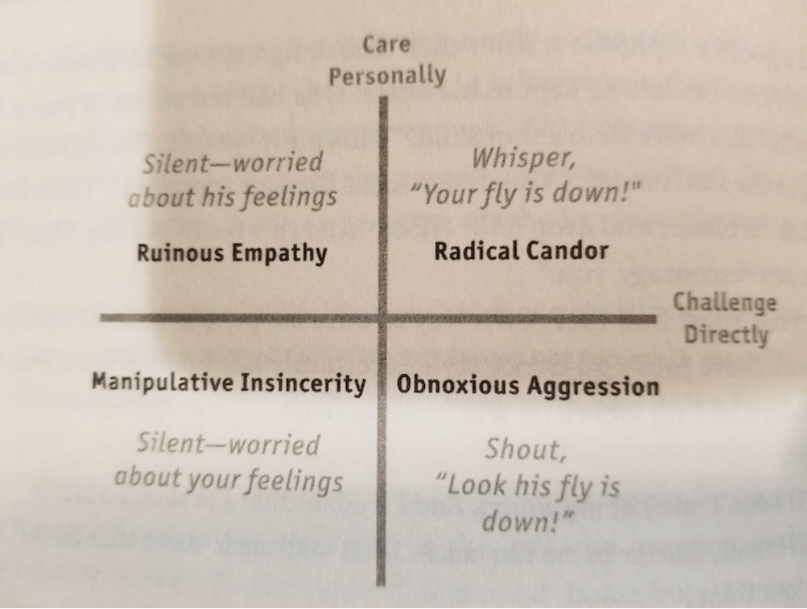

# 🎯 Constructive Feedback: The SBI Model

*How to give feedback that develops people instead of triggering their defenses*

Most feedback fails because it comes across as judgment rather than observation. We say "you're not communicating well" instead of describing what we actually saw and how it affected the situation. The result? Defensive responses, hurt feelings, and missed opportunities for growth.

After years of watching well-intentioned feedback conversations go sideways, I've learned that the structure of your feedback matters as much as the content. The **Situation-Behavior-Impact (SBI) model** provides that structure—turning subjective opinions into objective observations that people can actually use.

This isn't just another HR technique. It's a practical framework for having the hard conversations that make teams better while preserving the [psychological safety](People_-_Process_-_Technology_Triad.md#phase-2-people-first-investments) that enables growth.

## Table of Contents

- [Why Most Feedback Fails](#why-most-feedback-fails)
- [The SBI Framework](#the-sbi-framework)
- [Setting Up the Conversation](#setting-up-the-conversation)
- [The Three Components Explained](#the-three-components-explained)
- [Practical Examples](#practical-examples)
- [Common Mistakes and How to Avoid Them](#common-mistakes-and-how-to-avoid-them)
- [Making SBI a Team Habit](#making-sbi-a-team-habit)

## Why Most Feedback Fails

Before diving into the solution, let's understand the problem. Most feedback conversations trigger defensiveness because they violate basic principles of effective communication:

### The Attribution Error Trap
We judge others by their actions but ourselves by our intentions. When giving feedback, we often make assumptions about someone's motivations rather than focusing on observable behaviors.

**Instead of**: "You don't care about this project"  
**Try**: "In the last three meetings, I noticed you haven't contributed to the discussion about timeline concerns"

### The Judgment Problem  
Feedback often sounds like a verdict rather than an observation. This puts people in a defensive position where they feel the need to justify themselves rather than learn.

**Instead of**: "You're bad at presenting"  
**Try**: "During today's client presentation, I noticed you looked down at your notes frequently and spoke quietly"

### The Vague Impact Issue
We fail to connect specific behaviors to their actual consequences, leaving people unsure about why the feedback matters.

**Instead of**: "Your communication needs improvement"  
**Try**: "When you didn't respond to the urgent Slack message for two hours, the client escalation couldn't be resolved, and we had to schedule an emergency call"

## The SBI Framework

The Situation-Behavior-Impact model, developed by the Center for Creative Leadership, provides a structure that avoids these common pitfalls:

- **Situation**: Set the context with specific when/where details
- **Behavior**: Describe observable actions without interpretation  
- **Impact**: Explain the effect on you, others, or the business

This framework works for both positive recognition and corrective feedback because it focuses on facts rather than judgments.

### Why SBI Works

1. **Reduces defensiveness** by avoiding personal attacks or character judgments
2. **Increases clarity** by being specific about what happened and why it matters
3. **Enables learning** by connecting actions to consequences
4. **Shows respect** by treating the person as capable of understanding and improving

## Setting Up the Conversation

The delivery matters as much as the content. Here's how to create the right environment for productive feedback:

### Ask Permission
**"Are you open to some feedback about the client meeting?"**

This simple question:
- Respects the person's autonomy
- Reduces ambush anxiety  
- Increases receptiveness
- Shows you care about their comfort

### State Your Intent
Make your motivation clear to prevent misinterpretation:

**For development**: "I want to help you continue growing in your role"  
**For clarification**: "I want to share my perspective so we can align better"  
**For recognition**: "I want to make sure you know the positive impact you're having"

### Choose the Right Moment
- **Private setting** for corrective feedback
- **Soon after the event** while details are fresh
- **When you both have time** to have a real conversation
- **When emotions are calm** and you can be objective

The Science Behind Psychological Safety in Feedback

From Kim Scott's *Radical Candor*:

> "Situation, behavior, impact. The Center for Creative Leadership developed this technique to help leaders be more precise and therefore less arrogant when giving feedback. This simple technique reminds you to describe three things: 1) the situation you saw, 2) the behavior, and 3) the impact you observed. This helps you avoid making judgments about the person's intelligence, common sense, innate goodness, or other personal attributes."

The framework prevents [amygdala hijacking](https://www.healthline.com/health/stress/amygdala-hijack)—when the brain's threat detection system overwhelms rational processing. By focusing on observable facts rather than character judgments, SBI keeps conversations in the rational processing zone where learning can happen.

## The Three Components Explained

### S: Situation (Set the Context)

**Purpose**: Provide specific context so the person knows exactly what you're referring to.

**What to include**:
- When it happened (date, time, meeting name)
- Where it occurred (specific location or context)
- Who was involved (if relevant to the feedback)

**Example**: "During yesterday's architecture review meeting with the product team..."

**Keep it to**: 1-2 sentences maximum

### B: Behavior (Describe What You Observed)

**Purpose**: Focus solely on observable actions without interpretation or assumptions about motivation.

**What to include**:
- Specific actions you witnessed
- What was said or done (not why you think they did it)
- Observable facts that could be captured on video

**What to avoid**:
- Mind reading ("you didn't care")
- Character judgments ("you're disorganized") 
- Assumptions about intent ("you were trying to undermine me")

**Example**: "When the product manager asked about timeline concerns, you looked at your phone, didn't respond verbally, and continued working on your laptop"

**Keep it to**: 2-3 sentences of pure observation

### I: Impact (Explain the Consequences)

**Purpose**: Help the person understand why their behavior mattered by connecting it to real consequences.

**What to include**:
- Effect on you personally
- Impact on others present
- Business or project consequences
- How it affected team dynamics or goals

**What to avoid**:
- Exaggeration or drama
- Assumed impacts you didn't actually observe
- Future predictions without evidence

**Example**: "As a result, we couldn't address their concerns in the meeting, the timeline discussion was incomplete, and I had to schedule a follow-up call to resolve the open questions"

**Keep it to**: 2-4 sentences focused on actual consequences

## Practical Examples

### Positive Recognition Example

**Full SBI Statement:**
"During yesterday's client presentation to Acme Corp, I noticed you anticipated three potential objections and prepared data to address each one before they were even raised. You also adjusted your explanation when you saw confused looks on their faces, using simpler terms to explain the technical concepts. As a result, the client seemed much more confident in our approach, asked follow-up questions that showed real engagement, and we secured their approval to move to the next phase. Your preparation and adaptability made the difference in landing this project."

Breaking Down the Example

**Situation**: "During yesterday's client presentation to Acme Corp..."
- Specific event, date, and audience

**Behavior**: "I noticed you anticipated three potential objections and prepared data to address each one... You also adjusted your explanation when you saw confused looks..."
- Observable actions without interpretation
- Specific examples of what was done

**Impact**: "As a result, the client seemed much more confident... we secured their approval... Your preparation made the difference..."
- Clear connection between behavior and outcomes
- Both immediate and business impacts included

### Corrective Feedback Example

**Full SBI Statement:**
"In this morning's sprint planning meeting, when Sarah was explaining the database performance issue, I noticed you interrupted her twice and started typing on your laptop while she was still talking. When she asked if you had questions, you said 'it's fine' without looking up from your screen. This made Sarah visibly frustrated—she stopped mid-explanation and looked confused about whether to continue. The team couldn't get clarity on the performance requirements, and we had to table the story for next sprint. I'm concerned this pattern might be making it harder for the team to collaborate effectively."

Breaking Down the Example

**Situation**: "In this morning's sprint planning meeting, when Sarah was explaining the database performance issue..."
- Specific meeting, time, and context

**Behavior**: "I noticed you interrupted her twice and started typing... you said 'it's fine' without looking up..."
- Observable actions only
- No assumptions about intent or character

**Impact**: "This made Sarah visibly frustrated... The team couldn't get clarity... we had to table the story..."
- Multiple types of impact: interpersonal, team dynamics, and business consequences
- Observable reactions, not assumed feelings

### Peer-to-Peer Example

**Full SBI Statement:**
"During last week's code review discussion, when I suggested refactoring the authentication module, you immediately pulled up three examples of similar patterns we'd used successfully in other services and walked through the pros and cons of each approach. You also pointed out a security consideration I'd missed. This helped me understand why my initial suggestion wasn't optimal, and we ended up with a much better solution. I really appreciate how you challenged my thinking without making me feel defensive."

## Common Mistakes and How to Avoid Them

### Mistake 1: The Stealth Judgment
**What it looks like**: "During the meeting, you were clearly frustrated and not engaged"
**The problem**: "Clearly frustrated" is your interpretation, not observable behavior
**Better approach**: "During the meeting, you crossed your arms, frowned, and didn't speak for the first 30 minutes"

### Mistake 2: The Kitchen Sink
**What it looks like**: Bringing up multiple situations and behaviors in one conversation
**The problem**: Creates overwhelm and dilutes the message
**Better approach**: Focus on one specific situation and behavior per conversation

### Mistake 3: The Delayed Reaction
**What it looks like**: Giving feedback weeks or months after the behavior occurred
**The problem**: Details are fuzzy, context is lost, and change is harder
**Better approach**: Give feedback within 24-48 hours when possible

### Mistake 4: The Mind Reader
**What it looks like**: "You obviously don't care about this project"
**The problem**: Assumes motivation and intent
**Better approach**: "In the last three meetings, you arrived 10 minutes late and didn't contribute to the discussion"

### Mistake 5: The Drama Queen
**What it looks like**: "This completely derailed everything and caused massive confusion"
**The problem**: Exaggeration undermines credibility
**Better approach**: "This caused the meeting to run 15 minutes over and left two action items unclear"

### Mistake 6: The Vague Impact
**What it looks like**: "It just doesn't feel professional"
**The problem**: Unclear why the behavior matters
**Better approach**: "It made the client question our attention to detail, and they asked if we were taking the project seriously"

## Making SBI a Team Habit

### Start with Self-Awareness
Before giving feedback to others, practice SBI on yourself:
- What specific behaviors am I demonstrating?
- How might others be experiencing the impact?
- Am I focusing on facts or making assumptions?

### Use It for Recognition Too
SBI isn't just for corrective feedback. Use it to reinforce positive behaviors:
- Celebrate specific actions that drove results
- Help people understand what they should continue doing
- Build confidence by connecting behaviors to impact

### Create Team Agreements
Consider establishing team norms around feedback:
- Regular feedback is expected and welcome
- We focus on behaviors, not personalities
- We give feedback soon after observing the behavior
- We assume positive intent and focus on growth

### Practice in Low-Stakes Situations
Start using SBI for everyday interactions:
- Thanking someone for help
- Clarifying misunderstandings
- Recognizing good work in team meetings

This builds the muscle memory before you need it for difficult conversations.

## The Bottom Line

Effective feedback isn't about being nice or being tough—it's about being clear, specific, and helpful. The SBI model provides a framework that:

- **Respects people** by focusing on behaviors rather than character
- **Enables growth** by connecting actions to consequences  
- **Builds trust** through objective observation rather than subjective judgment
- **Improves performance** by giving people actionable information they can use

Remember: the goal isn't perfect feedback—it's better feedback. Start using SBI in low-stakes situations, focus on one behavior at a time, and remember that your intent to help someone grow matters as much as your technique.

Great teams are built on great feedback. When people feel safe to receive honest observations about their work, they can make the adjustments that turn good performance into exceptional results.

## Quick Reference

### Before the Conversation
- [ ] Ask permission: "Are you open to some feedback?"
- [ ] State your intent: "I want to help you continue growing"
- [ ] Choose the right time and place

### During the Conversation  
- [ ] **Situation**: Specific context (when, where, who)
- [ ] **Behavior**: Observable actions only (no interpretations)
- [ ] **Impact**: Clear consequences (on you, others, business)
- [ ] Don't label with "S-B-I"—let it flow naturally

### After the Conversation
- [ ] Give them space to process
- [ ] Follow up if needed
- [ ] Recognize improvements when you see them

### For Written Feedback
When giving feedback in writing (performance reviews, code review comments, project retrospectives), apply SBI principles with the techniques from [Professional Writing for Engineers](Professional_Writing_Tips.md) for maximum clarity and impact.

## Additional Reading

- **[Radical Candor](https://www.goodreads.com/book/show/29939161-radical-candor)** by Kim Scott - The definitive guide to caring personally while challenging directly
- **[Thanks for the Feedback](https://www.goodreads.com/book/show/18114120-thanks-for-the-feedback)** by Douglas Stone - How to receive feedback effectively (useful for giving it too)
- **[Weasel Words Guide](Weasel_Words.md)** - Eliminate vague language that undermines your feedback's impact

-----

*Have your own templates or hard-won lessons? I'd love to hear them. Drop a comment or [open an issue](https://github.com/bordenet/Engineering_Culture/issues/new) to share.*