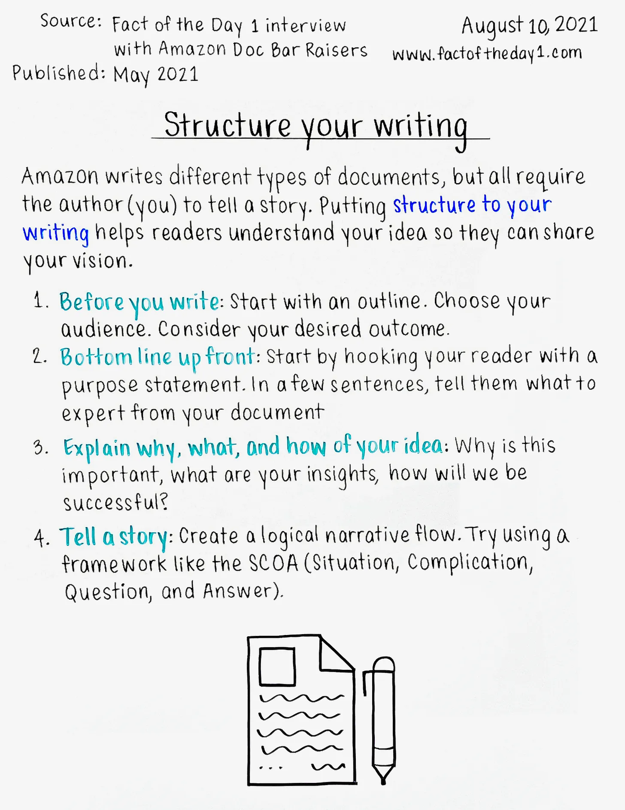
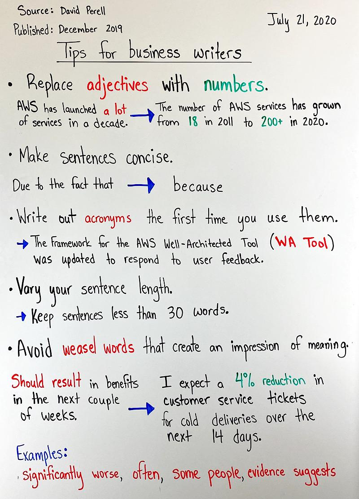
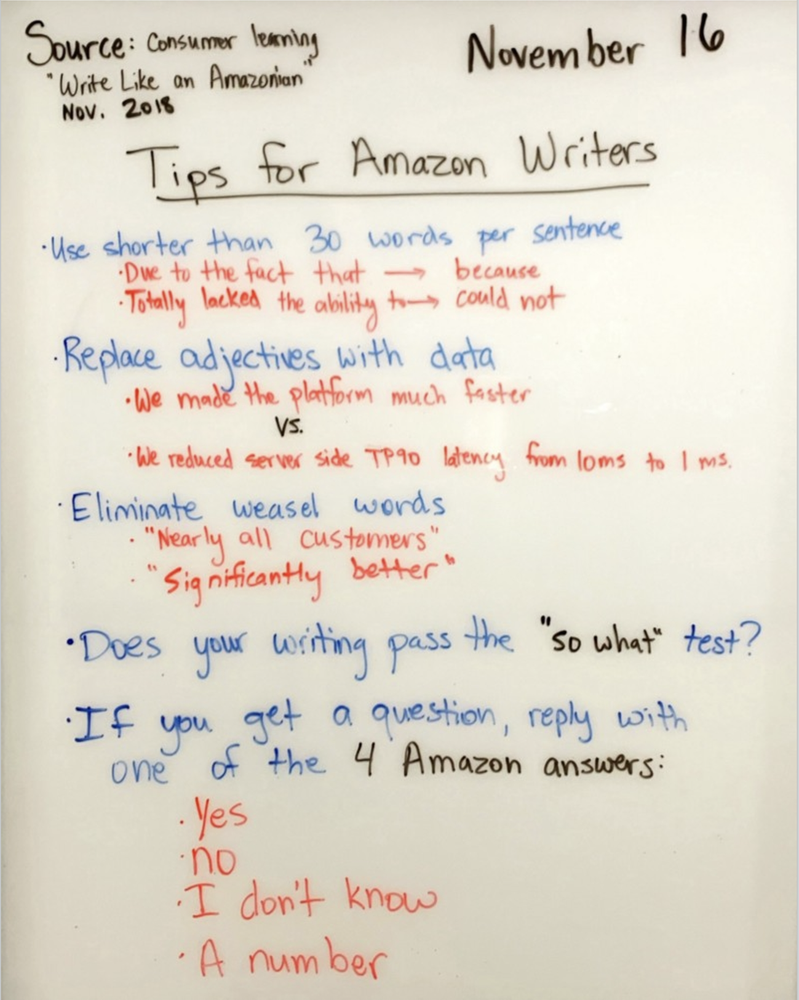
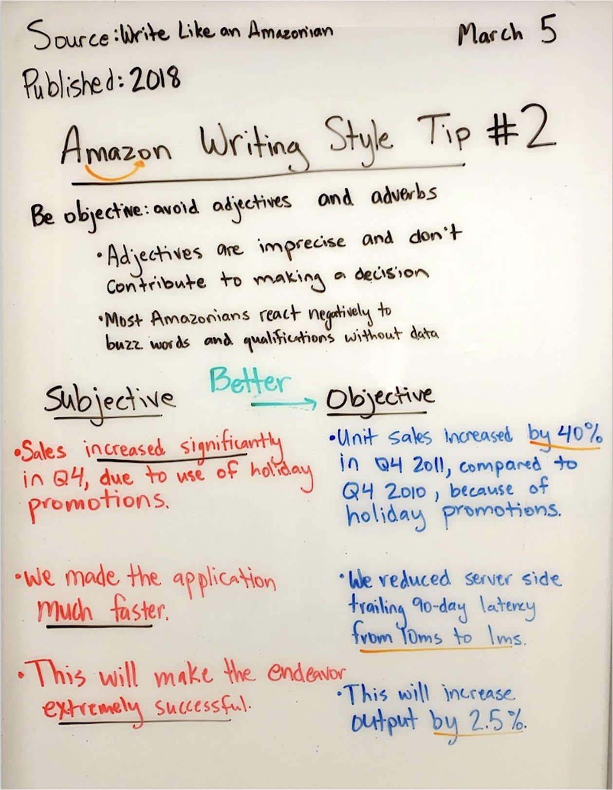
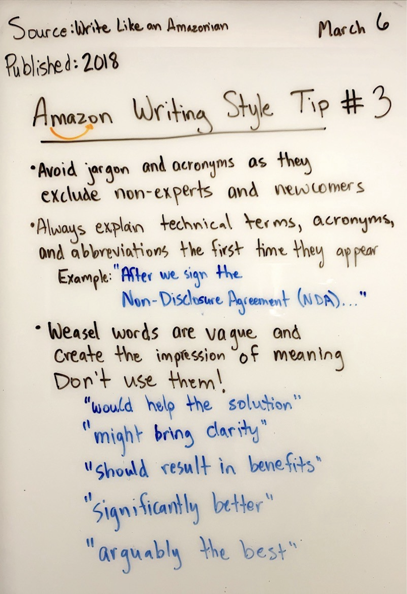
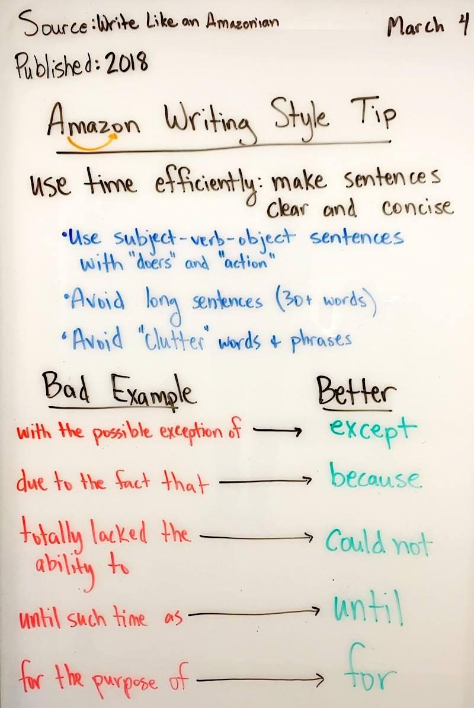
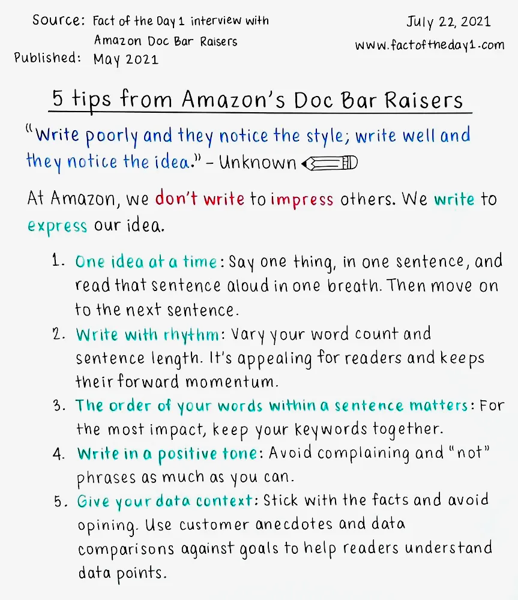
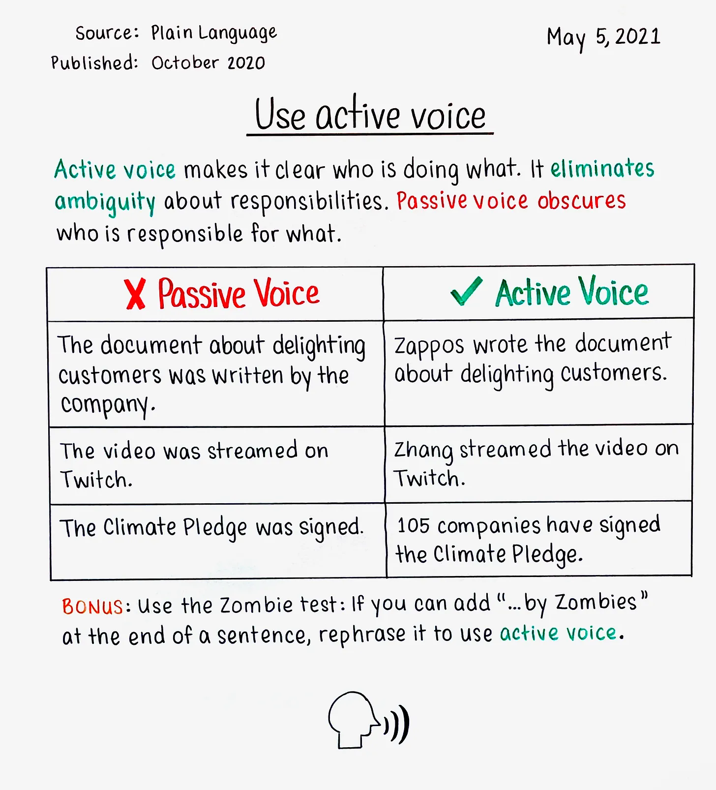

# ✍️ Professional Writing for Engineers: Beyond Code Comments

*How clear writing becomes your most scalable skill and differentiates great engineers from good ones*

In 26+ years of engineering leadership, I've noticed something: the engineers who advance fastest aren't always the most technically brilliant. They're the ones who can articulate complex ideas clearly, influence without authority, and scale their impact beyond what they can personally code.

Professional writing isn't just nice-to-have for engineers—it's a force multiplier. Whether you're documenting architecture decisions, proposing new initiatives, or giving feedback to colleagues, your ability to communicate clearly in writing directly impacts your career trajectory and your team's success.

This isn't about becoming a novelist. It's about developing the specific writing skills that make engineering teams more effective, decisions more informed, and careers more successful.

## Why Writing Matters More Than You Think

### The Introvert's Superpower
Great writing levels the playing field. In meetings, the loudest voice often wins. In writing, the clearest thinking wins. This is why many introverted engineers find their written proposals carry more weight than their verbal contributions—the ideas get judged on their merits, not on delivery style.

### The Scale Factor
Code impacts systems. Writing impacts people. A well-written design document influences dozens of engineers. A clear post-mortem prevents future outages across the organization. A compelling project proposal secures resources for your team's most important work.

### The Amazon Lesson
Amazon's culture of written narratives over PowerPoint presentations isn't arbitrary—it forces clarity of thinking. You cannot hide fuzzy logic behind impressive slides when you have to write complete sentences that connect your ideas logically.

As Jeff Bezos noted: "PowerPoint-style presentations somehow give permission to gloss over ideas, flatten out any sense of relative importance, and ignore the interconnectedness of ideas."

## Table of Contents

- [The Engineering Writing Framework](#the-engineering-writing-framework)
- [Phase 1: Clarify Your Intent](#phase-1-clarify-your-intent)
- [Phase 2: Structure for Impact](#phase-2-structure-for-impact)
- [Phase 3: Write with Precision](#phase-3-write-with-precision)
- [Phase 4: Revise Ruthlessly](#phase-4-revise-ruthlessly)
- [Document-Specific Guidance](#document-specific-guidance)
- [Common Writing Mistakes Engineers Make](#common-writing-mistakes-engineers-make)
- [Building Your Writing Practice](#building-your-writing-practice)

## The Engineering Writing Framework

Effective professional writing follows a systematic approach, just like good code architecture. Here's the framework I've developed over decades of writing and reviewing engineering documents:

### The Four Phases

1. **Clarify Your Intent**: What are you trying to achieve?
2. **Structure for Impact**: How will you organize your ideas?
3. **Write with Precision**: How will you express your thoughts clearly?
4. **Revise Ruthlessly**: How will you make every word count?

Each phase serves a specific purpose and builds on the previous one. Skip a phase, and your writing becomes less effective—just like skipping design phases in software development.

## Phase 1: Clarify Your Intent

Before writing a single word, answer these questions:

### The Core Questions
- **What specific outcome do I want?** (Decision, approval, understanding, action)
- **Who is my primary audience?** (Their expertise level, concerns, constraints)
- **What does success look like?** (How will I know my writing worked?)
- **What's the one thing** they must understand or do after reading this?

### Engineering Example: Architecture Proposal

**Bad intent**: "Document our microservices migration plan"  
**Good intent**: "Get approval from senior leadership to allocate 3 engineers for 6 months to extract the user service, reducing deployment risk and enabling independent scaling"

Notice how the good intent is specific about the desired outcome (approval), audience (senior leadership), resources (3 engineers, 6 months), and business justification (risk reduction, scalability).

### The Context Matrix

For any engineering document, consider your audience's perspective:

| **Audience Type** | **Primary Concerns** | **Language Style** | **Level of Detail** |
|:------------------|:---------------------|:-------------------|:-------------------|
| **Senior Leadership** | Business impact, resource allocation, timeline | Business outcomes, clear trade-offs | High-level with detailed appendix |
| **Peer Engineers** | Technical feasibility, implementation details | Technical accuracy, practical considerations | Deep technical detail |
| **Product Managers** | User impact, feature completeness, dependencies | Customer value, delivery timeline | Feature-focused with technical context |
| **External Teams** | Integration points, API contracts, support needs | Clear interfaces, documentation quality | Specific to collaboration needs |

## Phase 2: Structure for Impact

Great engineering writing follows predictable patterns. Your readers should never wonder "where is this going?" or "why does this matter?"

### The Universal Document Structure

Every professional document should include:

1. **Executive Summary** (what and why in 2-3 sentences)
2. **Context** (background your audience needs)
3. **Core Content** (your main argument or information)
4. **Next Steps** (what happens next and who does what)
5. **Appendix** (supporting details that might distract from main message)

### Engineering-Specific Structures

**For Technical Proposals:**
- Problem Statement → Proposed Solution → Alternatives Considered → Implementation Plan → Success Metrics

**For Post-Mortems:**
- Incident Summary → Timeline → Root Cause Analysis → Action Items → Prevention Measures

**For Design Documents:**
- Requirements → Architecture Overview → Detailed Design → Trade-offs → Implementation Plan

**For Project Updates:**
- Progress Summary → Blockers → Decisions Needed → Next Milestones → Risk Assessment

### The Pyramid Principle

Structure your arguments like an inverted pyramid:
- **Top**: Most important information (conclusion or recommendation)
- **Middle**: Supporting arguments and evidence
- **Bottom**: Detailed data and technical appendices

This allows busy executives to get the key points immediately while providing depth for those who need it.

## Phase 3: Write with Precision

Engineering writing demands clarity above all else. Ambiguity in requirements leads to bugs. Ambiguity in communication leads to misaligned teams.

### The Precision Principles

#### 1. Use Active Voice
**Instead of**: "The database connection was not established"  
**Write**: "The service failed to connect to the database"

Active voice assigns clear responsibility and creates more direct, actionable language.

#### 2. Eliminate [Weasel Words](Weasel_Words.md)
**Instead of**: "This will significantly improve performance"  
**Write**: "This will reduce API response time from 200ms to 50ms"

Specific metrics make your writing credible and actionable.

#### 3. Front-Load Your Sentences
**Instead of**: "Due to the complexity of the current authentication system and the need for better security, we should implement SSO"  
**Write**: "We should implement SSO. The current authentication system is complex and creates security vulnerabilities"

Put the main point first, then provide supporting details.

#### 4. Use Parallel Structure
**Instead of**: "The system needs to be fast, reliable, and we want good security"  
**Write**: "The system needs to be fast, reliable, and secure"

Parallel structure makes your writing easier to parse and more professional.

### Technical Writing Patterns

**For Explaining Complex Systems:**
- Start with the user journey or business flow
- Explain components from outside-in
- Use concrete examples before abstract concepts
- Include diagrams for visual learners

**For Documenting Decisions:**
- State the decision clearly upfront
- Explain the options you considered
- Share your reasoning process
- Document assumptions and constraints

**For Writing Requirements:**
- Use "shall" for mandatory requirements
- Use "should" for recommended approaches
- Use "may" for optional features
- Number requirements for easy reference

## Phase 4: Revise Ruthlessly

Great writing is rewriting. Your first draft gets the ideas out. Your revisions make them clear, compelling, and actionable.

### The Three-Pass Revision Method

**Pass 1: Structure Review**
- Does the organization serve the reader's needs?
- Is the flow logical and easy to follow?
- Are the most important points prominent?

**Pass 2: Clarity Review**
- Is every sentence clear and unambiguous?
- Can any technical jargon be simplified?
- Are examples concrete and relevant?

**Pass 3: Precision Review**
- Can any words be eliminated without losing meaning?
- Are all claims supported by evidence?
- Does every paragraph advance your main argument?

### The Revision Checklist

- [ ] **Executive summary** stands alone and captures key points
- [ ] **First paragraph** clearly states purpose and main message
- [ ] **Each section** has a clear purpose and logical flow
- [ ] **Transitions** connect ideas smoothly
- [ ] **Technical terms** are defined or linked to definitions
- [ ] **Action items** are specific and assigned to owners
- [ ] **Conclusion** reinforces main message and next steps

## Document-Specific Guidance

### Design Documents
- **Start with requirements**, not solutions
- **Consider multiple approaches** before recommending one
- **Document assumptions** that could change
- **Include success metrics** for measuring effectiveness
- **Plan for evolution** - how might this need to change?

### Project Proposals
- **Lead with business value**, not technical elegance
- **Quantify benefits** wherever possible (time saved, costs reduced, risks mitigated)
- **Address obvious concerns** preemptively
- **Provide clear timeline** with major milestones
- **Define success criteria** explicitly

### Status Updates
- **Lead with blockers** that need attention
- **Highlight decisions** that need to be made
- **Flag risks** before they become problems
- **Celebrate wins** to maintain team morale
- **Keep it scannable** for busy stakeholders

### Post-Mortems
- **Focus on systems, not individuals** when discussing causes
- **Be specific about action items** with owners and due dates
- **Share lessons learned** broadly to prevent recurrence
- **Follow up** to ensure action items are completed
- **Make it blameless** to encourage honest analysis

## Common Writing Mistakes Engineers Make

### Mistake 1: The Technical Brain Dump
**Problem**: Explaining everything you know instead of what the reader needs to know  
**Fix**: Start with the reader's questions, not your knowledge

### Mistake 2: The Buried Lede
**Problem**: Hiding the main point in the third paragraph  
**Fix**: Lead with your conclusion, then provide supporting details

### Mistake 3: The Assumption Trap
**Problem**: Assuming readers have the same context you do  
**Fix**: Provide necessary background and define terms

### Mistake 4: The Passive Voice Default
**Problem**: "The code was reviewed" instead of "Alice reviewed the code"  
**Fix**: Use active voice to assign clear responsibility

### Mistake 5: The Hedge Maze
**Problem**: "It might be possible that we could potentially consider..."  
**Fix**: Make clear recommendations with confidence

### Mistake 6: The Implementation Obsession
**Problem**: Focusing on how you'll build it before explaining why it matters  
**Fix**: Lead with [what and why](../SDLC/Understanding_What_vs_How.md), then explain how

## Building Your Writing Practice

### Start Small, Be Consistent
- **Improve your code comments**: Practice clarity in small doses
- **Write better commit messages**: One-line summaries force concision
- **Document your decisions**: Build the habit of explaining your reasoning
- **Volunteer for documentation**: Take on writing tasks others avoid

### Seek Feedback Actively
- **Ask specific questions**: "Is my main point clear?" not "What do you think?"
- **Find writing mentors**: Look for colleagues whose writing you admire
- **Join writing groups**: Many companies have internal writing communities
- **Read excellent examples**: Study documents that achieved their goals

### Learn from the Masters
Great engineering writing often comes from companies with strong writing cultures:

- **Amazon's PR-FAQ documents**: See how they work backwards from customer value
- **Stripe's engineering blog**: Notice their clarity in explaining complex systems
- **Netflix's tech blog**: Observe how they balance technical depth with accessibility
- **Google's SRE book**: Study their systematic approach to documenting practices

### The Compound Effect
Writing skill compounds like interest. Each document you write teaches you something new. Each revision makes you more precise. Each piece of feedback improves your next effort.

The engineers who invest in writing skills early in their careers find doors opening that remain closed to even brilliant engineers who can't communicate effectively.

Amazon's Writing Culture: The Historical Context

These principles originated from Amazon's unique culture where written narratives dominate decision-making. The images below show some of the specific guidance Amazon engineers received:

|                                                                     |                                                                     |
|:--------------------------------------------------------------------|:--------------------------------------------------------------------|
|  |  |

|                                                              |                                                              |
|:-------------------------------------------------------------|:-------------------------------------------------------------|
|  |  |
|  |  |

|                                                              |                                                                     |
|:-------------------------------------------------------------|:--------------------------------------------------------------------|
|  |  |

These images have been shared across social media since ~2018, demonstrating the lasting impact of Amazon's approach to professional writing.

## The Bottom Line

Professional writing isn't about perfect grammar or literary style—it's about achieving your goals through clear communication. Every email, design document, and project proposal is an opportunity to practice this skill.

The engineers who master professional writing find their ideas getting implemented, their proposals getting approved, and their careers advancing faster than peers with similar technical skills but weaker communication abilities.

### Important Cultural Caveat

**Some organizational cultures will find the narrative approach more effective than others.** In environments where people have grown intellectually lazy and gravitated toward nebulous PowerPoint decks, you may encounter significant attention span deficits. When colleagues lack the patience or focus to read even a well-crafted one-pager, you're dealing with much deeper organizational problems that need to be addressed before even ideal documents can make a meaningful impact.

These cultural challenges often manifest as:
- Preference for bullet points over structured arguments
- Resistance to reading anything longer than a few sentences
- Immediate requests to "just put it in slides"
- Decision-making based on presentation style rather than content quality

In such environments, you may need to gradually introduce better communication practices while simultaneously working on the underlying cultural issues around intellectual rigor and attention to detail.

**Start now**: Pick one type of document you write regularly and apply one technique from this guide. Measure the response. Iterate and improve.

Your future self—and your colleagues—will thank you for the investment.

## Additional Reading

### Framework Connections
- **[Weasel Words Guide](Weasel_Words.md)** - Eliminate imprecise language that undermines your writing
- **[What vs. How](../SDLC/Understanding_What_vs_How.md)** - Structure your writing around outcomes before implementation
- **[The PR-FAQ Mechanism](../SDLC/The_PR-FAQ.md)** - Amazon's approach to customer-focused writing
- **[SBI Feedback Model](Constructive_Feedback_SBI_Model.md)** - Structure feedback writing for maximum impact

### Recommended Books
- **[HBR Guide to Better Business Writing](https://www.goodreads.com/book/show/13586939-hbr-guide-to-better-business-writing)** - Systematic approach to professional writing
- **[Made to Stick](https://heathbrothers.com/books/made-to-stick/)** - Why some ideas survive and others die
- **[The Pyramid Principle](https://www.barbaraminto.com/)** - Logic and thinking in writing and presentation

-----

## 🧭 Navigation

**🏠 [Engineering Culture](../README.md)** → **📂 [Culture](../README.md#culture)** → **📄 Professional Writing for Engineers**

**Quick Links:** [🔝 Back to Top](#️-professional-writing-for-engineers-beyond-code-comments) | [📚 Additional Reading](#additional-reading) | [💬 Feedback](https://github.com/bordenet/Engineering_Culture/issues/new)

**Related in This Series:**
- [Constructive Feedback: SBI Model](./Constructive_Feedback_SBI_Model.md) - *Structured communication for feedback*
- [Weasel Words](./Weasel_Words.md) - *Clear, precise language guidelines*
- [People-Process-Technology Triad](./People_-_Process_-_Technology_Triad.md) - *Communication as foundation*

**Related Topics:**
- [Project Planning Documents](../SDLC/Project_Planning_Mechanisms:_Documents.md) - *Applying writing skills to technical docs*
- [Understanding What vs How](../SDLC/Understanding_What_vs_How.md) - *Clear thinking for clear writing*

---

*Have your own templates or hard-won lessons? I'd love to hear them. Drop a comment or [open an issue](https://github.com/bordenet/Engineering_Culture/issues/new) to share.*
