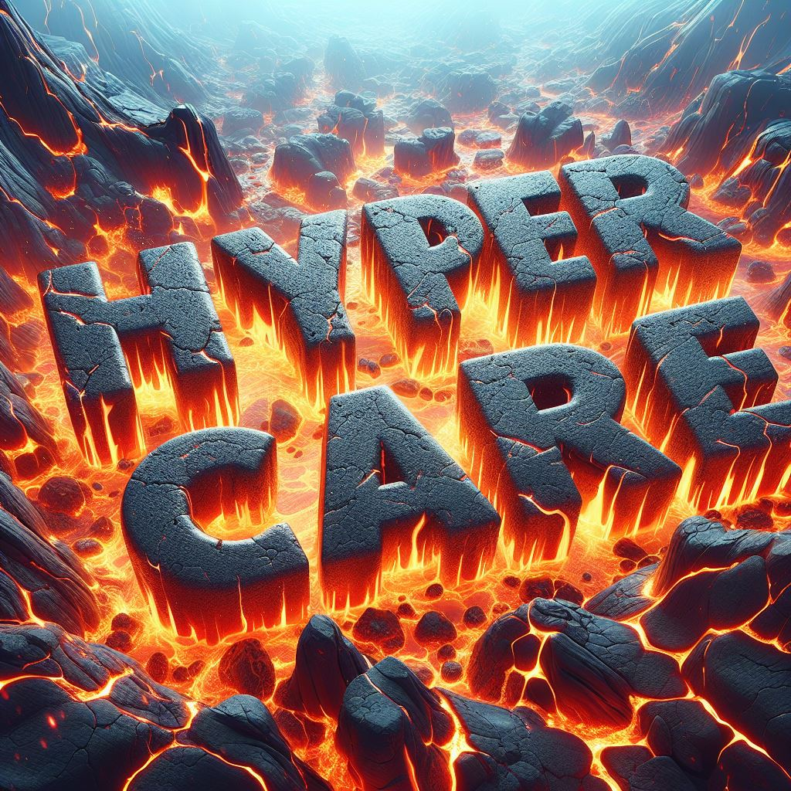

# 🚨 The Myth of "Hypercare": Why This Industry Term Undermines Operational Excellence

*How the concept of "hypercare" creates a false dichotomy between launch support and long-term ownership*

In the software industry, "hypercare" has become a common term describing the period of heightened support immediately following a major release or deployment. While well-intentioned, this concept fundamentally misrepresents how successful engineering teams should approach production systems.

This post examines why "hypercare" thinking is counterproductive and proposes a better framework based on consistent operational ownership rather than temporary heightened vigilance.

## Table of Contents

- [What Is "Hypercare"?](#what-is-hypercare)
- [The Problems with Hypercare Thinking](#the-problems-with-hypercare-thinking)
- [The Ownership Alternative](#the-ownership-alternative)
- [Building Sustainable Operations from Day One](#building-sustainable-operations-from-day-one)
- [From Reactive Support to Proactive Ownership](#from-reactive-support-to-proactive-ownership)
- [The Long-Term Perspective](#the-long-term-perspective)

## What Is "Hypercare"?

The industry defines hypercare as:

> **Hypercare**: The period of heightened customer support and attention immediately after a major change in operations. During hypercare, businesses are particularly vigilant and proactive in addressing customer needs, issues, and feedback to ensure a smooth transition and positive customer experience.

This definition reveals several assumptions:
- **Temporary vigilance**: Extra attention is only needed immediately after release
- **Reactive posture**: Teams respond to issues rather than prevent them
- **Artificial boundaries**: There's a clear distinction between "launch support" and "normal operations"

## The Problems with Hypercare Thinking

### Problem 1: The Consultant Mindset

Hypercare thinking reflects a consulting model where external teams deliver a solution and then gradually reduce involvement. This approach fails in product engineering because:

- **Teams don't disappear**: Engineering teams remain responsible for systems long-term
- **Learning accumulates**: Each incident and customer interaction provides valuable insights
- **Technical debt compounds**: Problems deferred during "hypercare" become larger issues later

**Better approach**: Treat every release as the beginning of a long-term relationship with the system, not a handoff event.

### Problem 2: False Sense of Security

"Hypercare" suggests that extra attention now means less attention later. This creates dangerous assumptions:

- **Monitoring becomes optional**: Teams may reduce observability investment after the "hypercare" period
- **Process shortcuts**: Important operational disciplines get treated as temporary measures
- **Knowledge loss**: Insights gained during launch don't get systematized for ongoing operations

**Better approach**: Build sustainable operational practices that maintain high reliability without requiring heroic effort.

### Problem 3: Reactive Rather Than Proactive

Hypercare focuses on responding to issues rather than preventing them. This leads to:

- **Fire-fighting culture**: Teams become skilled at crisis response but poor at prevention
- **Technical debt accumulation**: Root causes get band-aided rather than fixed
- **Operational fatigue**: Unsustainable support models burn out teams

**Better approach**: Invest in prevention through proper instrumentation, testing, and operational discipline from the start.

### Problem 4: Misaligned Incentives

When teams plan for "hypercare," they're planning for failure. This creates:

- **Lower quality standards**: "Good enough for launch" becomes the bar
- **Deferred technical debt**: Problems get postponed rather than solved
- **Operational anti-patterns**: Teams become comfortable with manual interventions

**Better approach**: Plan for success by building systems that require minimal operational intervention.

## The Ownership Alternative

Instead of "hypercare," successful engineering teams embrace **operational ownership**—consistent responsibility for system reliability throughout its lifecycle.

### Principles of Operational Ownership

**1. Consistent Care Standards**
The level of attention and care should remain high throughout the system's lifecycle, not just during launch periods.

**2. Preventive Investment**
Focus on building systems that require minimal intervention rather than systems that require heroic support.

**3. Continuous Learning**
Every operational event becomes input for systematic improvement rather than just crisis response.

**4. Sustainable Practices**
Operational approaches must be maintainable long-term without burning out teams.

## Building Sustainable Operations from Day One

### Foundation: Measurement and Visibility

Successful operations start with comprehensive observability:

**Essential Monitoring Components:**
- **Application metrics**: Response times, error rates, throughput—see [What Dashboards Are Good For](../EngFundamentals/What_Dashboards_are_Good_For.md) for building effective monitoring
- **Infrastructure metrics**: Resource utilization, capacity trends, performance indicators
- **Business metrics**: Customer impact, transaction success rates, service availability

**Alerting Strategy:**
- **Actionable alerts**: Every alert should correspond to a specific action someone can take
- **Appropriate urgency**: Page for customer-impacting issues, notify for trends that need attention
- **Clear escalation**: Well-defined paths for when issues exceed team capabilities

### Process: Incident Response and Learning

**Incident Management:**
- **Clear procedures**: Everyone knows their role when problems occur
- **Blameless culture**: Focus on system improvements rather than individual failures—see [Mechanisms: Building Self-Correcting Systems](../SDLC/Mechanisms:_Building_Self-Correcting_Systems.md) for systematic improvement approaches
- **Learning loops**: Every incident produces actionable improvements

**On-Call Practices:**
- **Sustainable rotations**: Distribute operational load across team members
- **Knowledge sharing**: Document solutions and ensure team members can cover for each other
- **Continuous improvement**: Regular retrospectives on operational effectiveness

### Architecture: Design for Operations

**Operational Considerations in Design:**
- **Observability first**: Build monitoring and alerting into system architecture
- **Graceful degradation**: Systems should fail safely and provide meaningful error messages
- **Operational interfaces**: Clear ways to inspect, debug, and maintain systems in production

## From Reactive Support to Proactive Ownership

### The Maturity Progression

**Level 1: Reactive Response**
- Wait for problems to occur, then respond quickly
- Heavy reliance on manual intervention and heroic effort
- Limited visibility into system behavior

**Level 2: Proactive Monitoring** 
- Comprehensive monitoring and alerting systems
- Systematic incident response procedures
- Regular operational reviews and improvement cycles

**Level 3: Predictive Operations**
- Trending and capacity planning prevent problems
- Automated responses for common operational scenarios
- Continuous optimization based on operational data

**Level 4: Self-Healing Systems**
- Systems automatically respond to common failure modes
- Operational excellence becomes competitive advantage
- Teams focus on innovation rather than maintenance

### Investment Priorities

**Short-term (0-3 months):**
1. **Implement comprehensive monitoring** across all critical services
2. **Establish clear incident response procedures** with defined roles and escalation paths
3. **Create operational runbooks** for common maintenance and troubleshooting tasks

**Medium-term (3-12 months):**
1. **Build automated responses** for common operational scenarios
2. **Implement capacity planning** based on actual usage patterns
3. **Develop operational dashboards** that provide clear visibility into system health

**Long-term (12+ months):**
1. **Create self-healing capabilities** for routine operational issues
2. **Build predictive monitoring** that identifies problems before customer impact
3. **Develop operational excellence** as organizational capability

## The Long-Term Perspective

### Sustainable Competitive Advantage

Organizations that embrace consistent operational ownership rather than "hypercare" thinking develop sustainable advantages:

**Customer Trust:**
- Consistent reliability builds customer confidence
- Predictable performance enables customer planning
- Professional incident communication maintains trust during problems

**Team Capability:**
- Operational expertise becomes organizational knowledge
- Teams develop deep understanding of system behavior
- Engineering decisions improve through operational feedback

**Business Velocity:**
- Reliable operations enable faster feature development
- Reduced operational overhead frees capacity for innovation
- Systematic approaches scale with organizational growth

### The Ownership Mindset

The fundamental shift is from viewing launches as discrete events requiring special treatment to viewing them as milestones in ongoing system evolution.

**Key Questions for Operational Ownership:**
- How will this system be monitored and maintained six months from now?
- What operational knowledge needs to be documented and shared?
- How do we build confidence in this system's reliability over time?
- What investments in tooling and process will pay dividends long-term?

## Beyond the Myth

"Hypercare" represents a fundamental misunderstanding of how successful engineering organizations operate. Instead of planning for intensive post-launch support, successful teams plan for sustainable, long-term operational excellence.

The goal isn't to eliminate the extra attention that new systems require—it's to build that attention into sustainable operational practices that serve the system throughout its lifecycle.

**Related Reading**: Understanding the [People-Process-Technology](People_-_Process_-_Technology_Triad.md) framework helps ensure your organization can support sustainable operational practices. The [SBI feedback model](Constructive_Feedback_SBI_Model.md) provides tools for conducting effective operational retrospectives that improve team performance.

## Additional Reading

### Operational Excellence Foundations
- **[Google SRE Book: Embracing Risk](https://sre.google/sre-book/embracing-risk/)** - How to balance reliability with feature velocity through systematic risk management
- **[Release It! by Michael Nygard](https://pragprog.com/titles/mnee2/release-it-second-edition/)** - Essential patterns for building resilient, production-ready systems
- **[The DevOps Handbook by Gene Kim](https://itrevolution.com/book/the-devops-handbook/)** - Comprehensive guide to building high-performing technology organizations

### Operational Culture
- **[Accelerate by Nicole Forsgren, Jez Humble, and Gene Kim](https://itrevolution.com/book/accelerate/)** - Research-backed insights on what makes high-performing engineering teams
- **[The Phoenix Project by Gene Kim](https://itrevolution.com/book/the-phoenix-project/)** - Business novel illustrating the transformation from reactive to proactive operations

---

## 🧭 Navigation

**🏠 [Engineering Culture](../README.md)** → **📂 [Culture](../README.md#culture)** → **📄 The Myth of Hypercare**

**Quick Links:** [🔝 Back to Top](#-the-myth-of-hypercare-why-this-industry-term-undermines-operational-excellence) | [📚 Additional Reading](#additional-reading) | [💬 Feedback](https://github.com/bordenet/Engineering_Culture/issues/new)

**Related in This Series:**
- [People-Process-Technology Triad](./People_-_Process_-_Technology_Triad.md) - *Getting organizational priorities right*
- [Understanding Conway's Law](./Understanding_Conways_Law.md) - *How structure affects operations*

**Related Topics:**
- [Mechanisms: Building Self-Correcting Systems](../SDLC/Mechanisms:_Building_Self-Correcting_Systems.md) - *Framework for operational excellence*
- [What Dashboards Are Good For](../EngFundamentals/What_Dashboards_are_Good_For.md) - *Operational visibility fundamentals*

---

*Have your own templates or hard-won lessons? I'd love to hear them. Drop a comment or [open an issue](https://github.com/bordenet/Engineering_Culture/issues/new) to share.*