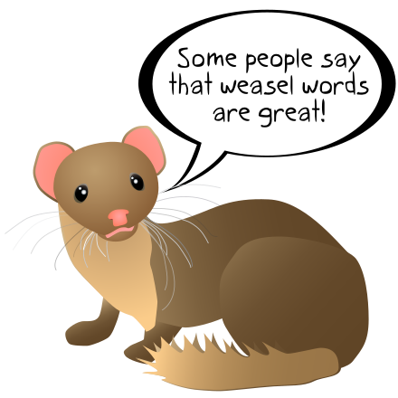
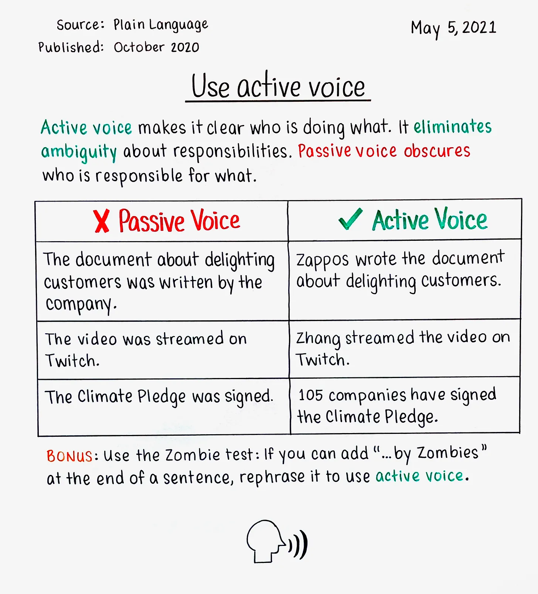

# 🗣️ Clear Communication: A Guide to Avoiding Weasel Words and Clichés

*Miscommunication is often the simplest way to derail a project, I've learned that precise language isn't just nice to have—it's essential for engineering effectiveness.*

Effective engineering relies on precision, not just in our code, but in our communication. I've seen ambiguous language, vague assertions, and conversational shortcuts erode trust and slow down progress more times than I can count. This post shares what I've learned about identifying and avoiding these communication pitfalls.

This guide is a call to action to eliminate imprecise language from our vocabulary.

This post will help you identify and replace common communication anti-patterns with clear, direct, and evidence-based language. Let's build a culture where ideas are judged on their merits, not on the cleverness of their phrasing.

  
## Table of Contents

- [What are Weasel Words?](#what-are-weasel-words)  
- [The Problem with Thought-Terminating Clichés](#the-problem-with-thought-terminating-clichés)  
- [The Power of Active Voice](#the-power-of-active-voice)  
- [Putting It All Together](#putting-it-all-together)

  

## What are Weasel Words?

A [weasel word](https://en.wikipedia.org/wiki/Weasel_word) is defined as “a word and phrase aimed at creating an impression that something specific and meaningful has been said when in fact only a vague, ambiguous, or irrelevant claim has been communicated.” These words suck the meaning out of a sentence, leaving the reader to guess at the intended message, and the term dates back to at least Ovid’s [_Metamorphoses_](https://en.wikipedia.org/wiki/Metamorphoses).

I've learned that when I catch myself using weasel words, it's usually a signal that I need to dig deeper, find the data, and state my point with clarity.

| Weasel Word Example | Replace with… |
| :--- | :--- |
| Significant impact/harm/improvement/etc | Real data. Subjective adjectives are unhelpful. |
| A lot | Real data. Subjective adjectives are unhelpful. |
| Too many | Real data along with pre-established expectations. |
| Would help the solution | Provide specific expectations. |
| Might bring clarity | State the desired outcome. Don’t be wishy-washy and indirect. Use active voice. |
| Should result in benefits | This is passive voice and uncertain hedging. Start over. |
| Arguably the best | According to who? This borders on being a logical fallacy. |
| Some people say | Who, when, and from what context did relevant observations originate. |

## The Problem with Thought-Terminating Clichés

**[Thought-terminating clichés](https://en.wikipedia.org/wiki/Thought-terminating_cliché)** are phrases used to shut down conversation and critical thought. They are roadblocks to productive discussion.

| Cliché | Replace with… |
| :--- | :--- |
| It is what it is | This is nonsensical. Backspace over this and figure out what you really intend to say. |
| This is above my pay grade | Act like an owner. |
| It’s all good | Take a moment to accept you might actually not be okay with the status quo. |
| Let’s agree to disagree | Use this only if you wish to stifle debate ASAP and close the door on further communication. Do so at your own peril. |
| Studies have shown… | If you want to cite studies, please be specific to spell out exactly which study and a concise summary of the findings. Otherwise it is as good as saying “because I say so”, it shuts down the conversation. |

## The Power of Active Voice

I've found that using **passive voice** or making indirect allusions undermines your position and forces your audience to work harder to understand you. It opens the door to ambiguity and can even feel like an attempt to shirk ownership.

[**Active Voice**](https://en.wikipedia.org/wiki/Active_voice), in contrast, is direct, clear, and action-oriented. It assigns responsibility and makes your statements stronger.

| Passive/Vague Snippet | Replace with… |
| :--- | :--- |
| It has been observed | Just state things directly. On \<date-time\>, \<specific occurrence\>… |
| Some have said | Either say who/when with context or move on. |
| Upper management is making us… | State what we’re doing together in the spirit of *disagree and commit* so that we can act like an aligned team. Don't ambiguously blame others; challenge the status quo directly with data. |

<strong>Click for a visual →</strong>

  
Source: https://www.factoftheday1.com/p/may-5-use-active-voice

## Putting It All Together

I've found that developing a habit of increasingly precise communication is one of the most powerful ways to improve your effectiveness and your team's effectiveness. In my experience, it helps facilitate a culture of ownership, transparency, and data-driven decision-making.

The core principle is simple: **say what you mean, and mean what you say**. By eliminating these anti-patterns, teams can ensure their conversations are productive, their documents are clear, and their projects are built on a solid foundation of shared understanding.

## Additional Reading

### Communication Excellence
- **[Made to Stick by Chip Heath and Dan Heath](https://heathbrothers.com/books/made-to-stick/)** - Why some ideas survive and others die, with practical frameworks for clear communication
- **[The Pyramid Principle by Barbara Minto](https://www.barbaraminto.com/)** - Classic framework for logical thinking and clear writing in business contexts
- **[On Writing Well by William Zinsser](https://www.harpercollins.com/products/on-writing-well-william-zinsser)** - Timeless principles of clear, effective writing

### Engineering Communication
- **[The Clean Coder by Robert Martin](https://www.oreilly.com/library/view/the-clean-coder/9780137081073/)** - Professional communication standards for software developers
- **[Crucial Conversations by Kerry Patterson](https://cruciallearning.com/crucial-conversations-book/)** - Tools for talking when stakes are high in engineering environments

-----

*Have your own templates or hard-won lessons? I'd love to hear them. Drop a comment or [open an issue](https://github.com/bordenet/Engineering_Culture/issues/new) to share.*
