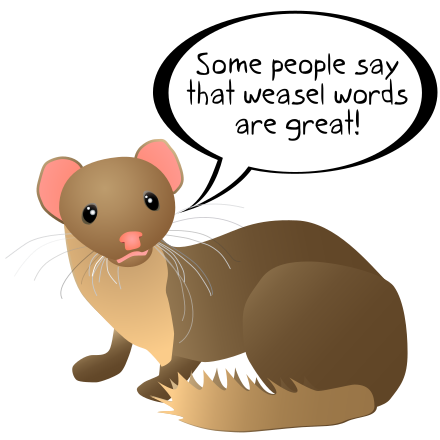

# Clear Communication: A Guide to Avoiding Weasel Words and Clichés

*Vague language isn't just a writing problem, it's a symptom of missing rigor.*

## Table of Contents

- [Why This Matters: A Story from Live Broadcast](#why-this-matters-a-story-from-live-broadcast)
- [What are Weasel Words?](#what-are-weasel-words)
- [The Problem with Thought-Terminating Clichés](#the-problem-with-thought-terminating-clichés)
- [The Power of Active Voice](#the-power-of-active-voice)
- [Putting It All Together](#putting-it-all-together)

  

## Why This Matters: A Story from Live Broadcast

Early in my post-Amazon career, I joined a startup to help accelerate their next growth phase. Within months, I noticed a pattern: proposals and calls-to-action would land, get head-nods, and go nowhere. I recall with chagrin two unhelpfully subjective words that leadership threw around on more than a few occasions: *"significant"* and *"profound."* Documents promised "significant improvements" and "profound impact"—but really, what did that even mean? 10%? 10x? Nobody asked. These intellectual shortcuts were killing the team's drive and setting us up to collectively underperform.

This common pattern was hard to miss for a new-hire with fresh eyes. The flagship product's logs and operator-facing metrics were universally dismissed as "inaccurate" and "misleading"—so much so that the most successful operators ran our live transcoders on instinct and vibes rather than data. We built, tested, and maintained an ASP.NET site presenting metrics literally nobody on the team trusted. Curious as to how the product was working? Operators would watch and listen to the video coming out of the service. That's not sustainable at scale.

Worse, when something went wrong, we'd hear "the source is good"—a claim that turned out to be wrong more than once. Operators weren't measuring packet loss or jitter—they were looking at video thumbnails and making dangerous assumptions or even outright guessing. And those guesses cost us and our customers dearly on numerous occasions. (Sorry, Hulu! Sorry, Fubo!!) This wasn't a dev environment—we were transcoding live broadcasts for major US networks. Not surprising then, that the first six or seven [COE's](../SDLC/Mechanisms:_Building_Self-Correcting_Systems.md#the-coe-correction-of-error-framework) I wrote with the team had "Data & Graphs" sections consisting of nothing but TODO-style placeholders with corresponding action items. We were building on quicksand, and the folks I spoke with who'd been there a while seemed not to notice anymore. They'd moved mountains to get the company through an acquisition, but our teams often felt as if we had stalled out.

This was much deeper than word choice—it was fundamental engineering culture. The team hadn't demanded rigor from its members and thus hadn't invested in the groundwork to produce credible data. We couldn't write "reduced latency by 40%" because nobody was tracking latency. We couldn't commit to "3-day turnaround" because nobody had baselined the current state. Vague language breeds mediocrity; precise language demands precise measurement. Both were missing—and this was something I'd absorbed at Amazon and could now share.

> [!NOTE]
> Weasel words are often a leading indicator of a deeper problem: if your team can't write with precision, ask whether they have the data and metrics to *think* with precision.

Only after building a quantitative, rigorous culture did things change—and not just the documents. The engineers themselves started responding more confidently and capably. Once people had real numbers, they stopped hiding behind vague adjectives and started owning their claims. And here's the key: when you bring objective data to the table, the *reader* gets to ascribe meaning. "Reduced P99 latency from 2350ms to 840ms" lets stakeholders judge significance for themselves.

It took about two years. The COE "Data & Graphs" sections filled up with actual graphs. The operators who'd been watching video streams had dashboards they trusted. And instead of claims like "the source is good," operators were reading real metrics—packet loss, jitter, and signal health—across the entire pipeline from source through publishing.

This guide will help you spot the anti-patterns—but remember: fixing the words without fixing the measurement culture is just cosmetic.

## What are Weasel Words?

A [weasel word](https://en.wikipedia.org/wiki/Weasel_word) is defined as “a word and phrase aimed at creating an impression that something specific and meaningful has been said when in fact only a vague, ambiguous, or irrelevant claim has been communicated.” These words suck the meaning out of a sentence, leaving the reader to guess at the intended message, and the term dates back to at least Ovid’s [_Metamorphoses_](https://en.wikipedia.org/wiki/Metamorphoses).

When you catch yourself using weasel words, it's usually a signal to dig deeper, find the data, and state your point with auditable facts. I've seen every one of these derail a review or leave a room nodding at nothing. They drive me nuts.

| Weasel Word Example | Replace with… |
| :--- | :--- |
| Significant impact/harm/improvement/etc | What's the number? 5%? 50%? If you don't know, find out. |
| A lot | How many? Put a number on it. |
| Too many | How many, and compared to what baseline? |
| Would help the solution | What outcome, by when? |
| Might bring clarity | Say what you actually want to happen. |
| Should result in benefits | You're hedging. Say what *will* happen, or admit you don't know. |
| Arguably the best | According to who? This borders on being a logical fallacy. |
| Some people say | Who, when, and from what context did relevant observations originate? |

## The Problem with Thought-Terminating Clichés

**[Thought-terminating clichés](https://en.wikipedia.org/wiki/Thought-terminating_cliché)** are phrases people reach for when they want to end a conversation without resolving it.

| Cliché | Replace with… |
| :--- | :--- |
| It is what it is | This is nonsensical. Backspace over this and figure out what you really intend to say. |
| This is above my pay grade | Escalate it or own it. Shrugging isn't a strategy. |
| It’s all good | Is it? Name what's actually bothering you. |
| Let’s agree to disagree | Use this only if you wish to stifle debate ASAP and close the door on further communication. Do so at your own peril. |
| Studies have shown… | Which study? Summarize the findings. Otherwise it's just "because I said so." |

## The Power of Active Voice

Passive voice is where accountability goes to hide.

[**Active Voice**](https://en.wikipedia.org/wiki/Active_voice), in contrast, is direct and action-oriented. It assigns responsibility and makes your statements stronger.

| Passive/Vague Snippet | Replace with… |
| :--- | :--- |
| It has been observed | Just state things directly. On \<date-time\>, \<specific occurrence\>… |
| Some have said | Either say who/when with context or move on. |
| Upper management is making us… | Own it as "we decided," not "they made us." If you disagree, challenge with data, not blame. |

<strong>Click for a visual →</strong>

  
Source: https://www.factoftheday1.com/p/may-5-use-active-voice

## Putting It All Together

If you can't state it precisely, you probably don't understand it well enough yet. That's not a failure—it's a signal to go find the data, do the analysis, or ask the hard question you've been avoiding.

The habit is simple: when you catch yourself reaching for a weasel word, stop and ask *"what do I actually mean?"* The answer is usually more interesting than the shortcut.

## Additional Reading

These shaped how I think about this stuff:

### Communication Excellence
- **[Made to Stick by Chip Heath and Dan Heath](https://www.goodreads.com/book/show/69242.Made_to_Stick)** - Why some ideas survive and others die, with practical frameworks for clear communication
- **[The Pyramid Principle by Barbara Minto](https://www.goodreads.com/book/show/33206.The_Minto_Pyramid_Principle?ref=nav_sb_ss_1_19)** - Classic framework for logical thinking and clear writing in business contexts
- **[On Writing Well by William Zinsser](https://www.goodreads.com/book/show/53343.On_Writing_Well)** - Timeless principles of clear, effective writing

### Engineering Communication
- **[The Clean Coder by Robert Martin](https://www.goodreads.com/book/show/10284614-the-clean-coder)** - Professional communication standards for software developers
- **[Crucial Conversations by Kerry Patterson](https://www.goodreads.com/book/show/15014.Crucial_Conversations)** - Tools for talking when stakes are high in engineering environments

---

## 🧭 Navigation

**🏠 [Engineering Culture](../README.md)** → **📂 [Culture](../README.md#culture)** → **📄 Clear Communication: Avoiding Weasel Words**

**Quick Links:** [🔝 Back to Top](#️-clear-communication-a-guide-to-avoiding-weasel-words-and-clichés) | [📚 Additional Reading](#additional-reading) | [💬 Feedback](https://github.com/bordenet/Engineering_Culture/issues/new)

**Related in This Series:**
- [Professional Writing Tips](./Professional_Writing_Tips.md) - *Comprehensive writing framework*
- [Constructive Feedback: SBI Model](./Constructive_Feedback_SBI_Model.md) - *Specific, actionable communication*

**Related Topics:**
- [Project Planning Documents](../SDLC/Project_Planning_Mechanisms:_Documents.md) - *Clear documentation principles*
- [Understanding What vs How](../SDLC/Understanding_What_vs_How.md) - *Precise thinking and communication*

---

*Have your own templates or hard-won lessons? I'd love to hear them. Drop a comment or [open an issue](https://github.com/bordenet/Engineering_Culture/issues/new) to share.*

***

*Licensed under [CC0 1.0](https://creativecommons.org/publicdomain/zero/1.0/). Reuse freely with attribution.*
