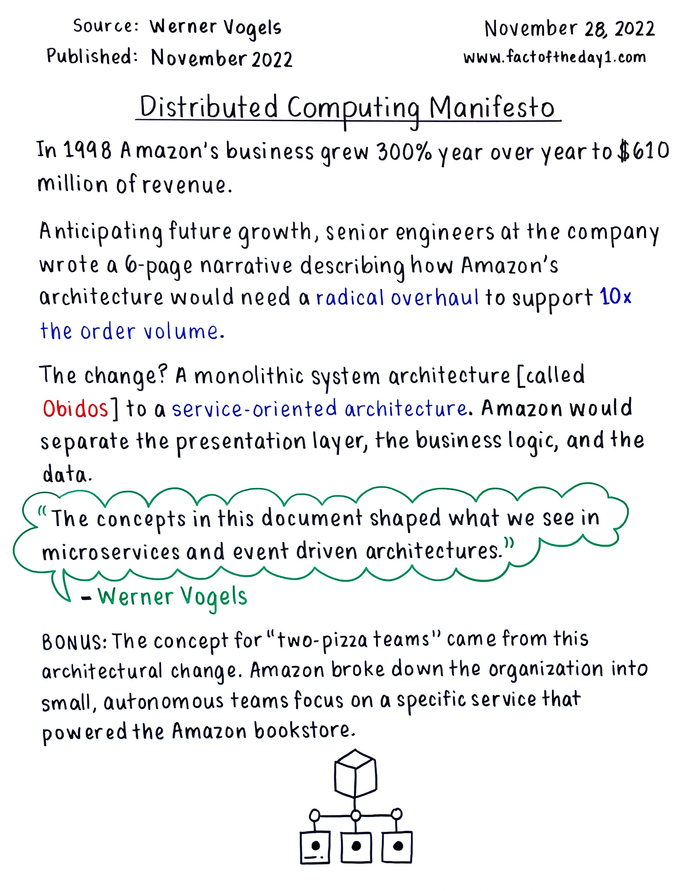

# 🏗️ SOA & Microservices: Clearing the Confusion

*Why understanding Service-Oriented Architecture is prerequisite to getting microservices right*

Lots of folks in our industry claim to be experts in microservices architecture. In most cases, the term makes me wince because something fundamental has been lost in the natural progression from SOA principles. **If you don't understand SOA deeply-- technically and culturally, you might be getting microservices all wrong.**

This isn't about being pedantic—it's about avoiding the expensive mistakes I've watched teams make when they jump straight to "microservices" without grasping the foundational concepts that make distributed systems actually work.

## Why This Matters Beyond Technology

Here's why I'm publishing this otherwise arbitrary piece of opinion: **SOA is as much a cultural approach as it is a technology choice.** When teams build robust APIs and treat their consumers as internal customers, it becomes natural for organizations to build working end-to-end systems that can survive the long haul.

I've seen too many engineering organizations focus on the technical patterns while ignoring the cultural transformation required. They extract services, implement REST APIs, and deploy to containers—but still operate with monolithic thinking. The result? Distributed systems that are harder to maintain than the monoliths they replaced.

The teams that succeed with SOA (and by extension, microservices) understand that technology choices are downstream from cultural choices. When you truly embrace service ownership, customer obsession, and operational excellence, the right architectural patterns follow naturally. For deeper insights on how organizational structure shapes system architecture, see [Understanding Conway's Law](../Culture/Understanding_Conways_Law.md).

## Table of Contents

- [The Foundation: What is SOA?](#the-foundation-what-is-soa)
- [SOA as Design Pattern](#soa-as-design-pattern) 
- [SOA as Mindset](#soa-as-mindset)
- [Microservices: SOA's Opinionated Evolution](#microservices-soas-opinionated-evolution)
- [When Microservices Make Sense (And When They Don't)](#when-microservices-make-sense-and-when-they-dont)
- [Common Anti-Patterns and How to Avoid Them](#common-anti-patterns-and-how-to-avoid-them)
- [Making the Transition](#making-the-transition)

## The Foundation: What is SOA?

Service-Oriented Architecture is both an architectural **design pattern** and a **mindset**. Get both wrong, and you'll build a distributed monolith that's harder to maintain than what you started with.

## SOA as Design Pattern

The best reference I've found remains [AWS's SOA overview](https://aws.amazon.com/what-is/service-oriented-architecture/). This shouldn't surprise anyone—SOA is one of the defining reasons Amazon has scaled to global reach while maintaining development velocity.

**Core SOA Principles:**
- **Well-formed APIs** with consistent standards for maximum interoperability
- **Independent deployability**—if you can't deploy your service independently, fix that gap immediately
- **Zero-downtime deployments** are table-stakes, not aspirations  
- **Predictable, simple behaviors** that minimize system-wide quirks
- **No tight coupling** across disparate services—this kills scalability

The goal: Distill overall problem complexity into a composition of simpler, focused services. This is challenging, but the alternative—a tangled mess of dependencies—is worse.

The famous Jeff Bezos memo

`All teams will henceforth expose their data and functionality through service interfaces.`

`Teams must communicate with each other through these interfaces.`

`There will be no other form of interprocess communication allowed: no direct linking, no direct reads of another team's data store, no shared-memory model, no back-doors whatsoever. The only communication allowed is via service interface calls over the network.`

`It doesn't matter what technology they use. HTTP, Corba, Pubsub, custom protocols — doesn't matter.`

`All service interfaces, without exception, must be designed from the ground up to be externalizable. That is to say, the team must plan and design to be able to expose the interface to developers in the outside world. No exceptions.`

`Anyone who doesn't do this will be fired.`

`Thank you; have a nice day!`

If you’re familiar with Bezos’s unique personality, those last two lines are priceless. (He presumably intended for folks to take the termination bit literally, and he very likely included the last line for humor. Unless you’re a customer, I assure you he doesn’t care about how your day goes.)

<https://konghq.com/blog/enterprise/api-mandate>

How AMZN explained SOA to share holders

[[source](https://www.factoftheday1.com/p/service-oriented-architecture-54b788b55e4e?utm_source=%2Fsearch%2FSOA&utm_medium=reader2)]

## SOA as Mindset

Beyond the technical patterns, SOA demands a fundamental shift in how teams operate. This is where most organizations fail—they adopt the technology but ignore the organizational changes required.

### Service Teams: The Human Element

Successful SOA requires **service teams**—self-sufficient groups that operate with genuine customer obsession through world-class APIs. These teams:

- **Own their full stack**: Infrastructure, deployments, monitoring, and on-call responsibilities  
- **Operate with autonomy**: Make technology choices that serve their customers best
- **Practice radical ownership**: Take pride in what they build and maintain
- **Default to automation**: Everything should be self-service to ensure reliability and responsiveness

### The Unix Philosophy Applied

What happens behind each service's API matters less than the interface itself, provided teams avoid careless dependencies. This mirrors the [Unix philosophy](https://en.wikipedia.org/wiki/Unix_philosophy): decoupled systems, each excellent at one specific thing, connected through clean interfaces.

**Think of APIs as pipes**: Simple, composable, and focused on data transformation rather than implementation details.

### Conway's Law in Action

Your architecture will mirror your organization's communication structure. If you want loosely coupled services, you need loosely coupled teams. Consider the delta between your current org chart and your desired architecture—that gap represents the real work ahead.

This is why the [People-Process-Technology triad](../Culture/People_-_Process_-_Technology_Triad.md) matters so much in SOA adoption—you can't just change the technology and expect different results. The organizational design work is often harder than the technical work.

## Microservices: SOA's Opinionated Evolution  

Microservices aren't a replacement for SOA—they're SOA with additional constraints and opinions. Understanding this relationship prevents the most common mistake: thinking microservices are just "small services."

### What Makes Microservices Different

| **Aspect** | **SOA** | **Microservices** |
|:-----------|:--------|:------------------|
| **Service Size** | Varies based on domain boundaries | Deliberately small, single-purpose |
| **Data Management** | May share databases | Each service owns its data |
| **Communication** | Various protocols (SOAP, REST, messaging) | Typically REST/HTTP + async messaging |
| **Technology Stack** | Often standardized across organization | Polyglot—teams choose their stack |
| **Deployment** | May share infrastructure | Independent deployment pipelines |
| **Team Structure** | Can span multiple services | One team per service (or small set) |

### The Microservices Value Proposition

When done well, microservices offer:
- **Faster development cycles** through team autonomy
- **Independent scaling** of system components  
- **Technology diversity** matched to problem domains
- **Fault isolation** that prevents cascading failures
- **Easier testing** of focused business logic

## When Microservices Make Sense (And When They Don't)

The industry's microservices enthusiasm has led to cargo cult adoption. Let's be clear about when this pattern adds value versus when it adds complexity.

### ✅ Consider Microservices When:

- **Team size exceeds 8-10 people** and coordination overhead is slowing development
- **Different system components have vastly different scaling requirements** (e.g., read-heavy reporting vs. write-heavy transactions)
- **You have genuinely independent business capabilities** that evolve at different rates
- **Your organization can realistically support multiple deployment pipelines, monitoring systems, and on-call rotations**
- **You're optimizing for long-term system evolution** over immediate feature delivery
- **You have evidence** (not assumptions) that service boundaries are stable

### ❌ Avoid Microservices When:

- **Starting a new product** where domain boundaries are still unclear
- **Your team lacks distributed systems experience** or operational maturity
- **You can't afford the infrastructure and monitoring overhead** of multiple services
- **Your data model requires complex transactions** across service boundaries
- **You're under pressure to deliver features quickly** and can't invest in proper tooling
- **Your organization isn't ready** for the cultural changes required

### The Monolith-First Approach

Martin Fowler's advice remains sound: [start with a monolith](https://martinfowler.com/bliki/MonolithFirst.html). You'll learn your domain boundaries through real usage patterns, not theoretical analysis. Extract services when you have evidence they should be separate, not when you think they might be.

## Common Anti-Patterns and How to Avoid Them

Having reviewed dozens of "microservices" architectures, these anti-patterns appear repeatedly:

### Anti-Pattern 1: The Distributed Monolith
**Symptom**: Services that can't be deployed independently  
**Cause**: Shared databases, synchronous communication chains, or tight coupling  
**Fix**: Identify and break dependencies. Use async messaging and event sourcing where appropriate.

### Anti-Pattern 2: Chatty Services  
**Symptom**: Services making dozens of calls to complete simple operations  
**Cause**: Fine-grained service boundaries that don't match real workflows  
**Fix**: Redesign boundaries around business capabilities, not data entities.

### Anti-Pattern 3: The God Service
**Symptom**: One service handling multiple unrelated business functions  
**Cause**: Fear of creating "too many" services or unclear domain understanding  
**Fix**: Apply single responsibility principle at the service level.

### Anti-Pattern 4: Shared Database Hell
**Symptom**: Multiple services reading/writing the same database tables  
**Cause**: Taking shortcuts during extraction or unclear data ownership  
**Fix**: Establish clear data ownership and use APIs for cross-service data access.

### Anti-Pattern 5: Micromanagement Services
**Symptom**: Services so small they require orchestration for trivial operations  
**Cause**: Confusing "micro" with "tiny"  
**Fix**: Size services around cohesive business capabilities, not lines of code.

### Anti-Pattern 6: Database Per Service Dogma
**Symptom**: Every microservice has its own database, leading to dozens of disparate data stores that don't share information effectively  
**Cause**: Misapplying the "database per service" principle without considering data relationships and query patterns  
**Result**: 
- Painful cross-service joins requiring multiple network calls
- Slow query execution due to data scatter across systems
- Loss of referential integrity and transactional consistency
- No single source of truth for business entities
- Complex data synchronization and eventual consistency challenges
- Operational nightmare managing dozens of database instances

**Fix**: 
- Group related services around shared data domains rather than forcing database isolation
- Use shared databases for services that truly need transactional consistency
- Implement proper data ownership boundaries without reflexive database separation
- Consider read replicas and views before creating separate databases
- Reserve database-per-service for truly independent business domains

## Making the Transition

If you're moving from monolith to services (micro or otherwise), here's a practical approach:

### Phase 1: Establish SOA Foundations
1. **Identify service boundaries** through domain analysis
2. **Build internal APIs** within your monolith
3. **Implement proper monitoring** and observability—see [What Dashboards Are Good For](What_Dashboards_are_Good_For.md) for building effective service monitoring
4. **Practice independent deployments** (even if still deploying together)

### Phase 2: Extract Strategically  
1. **Start with leaf services** that have minimal dependencies
2. **Focus on business value**, not technical elegance
3. **One service at a time**—resist the urge to extract multiple services simultaneously
4. **Measure everything**: Response times, error rates, team velocity

### Phase 3: Optimize and Evolve
1. **Learn from production feedback** before making more extractions
2. **Invest in tooling**: Service discovery, circuit breakers, distributed tracing
3. **Build team expertise** in distributed systems patterns
4. **Document your learnings** for future extractions

## The Bottom Line

SOA and microservices aren't competing philosophies—they're part of an evolutionary path toward better system design. The key insights:

1. **Master SOA principles first**. Microservices without SOA foundations become distributed monoliths that are harder to maintain than what you started with.

2. **Culture eats architecture for breakfast**. Your system design will mirror your organizational design, so be intentional about both.

3. **Start simple, evolve with evidence**. Monoliths aren't failures—they're laboratories for discovering your true service boundaries.

4. **Optimize for outcomes, not elegance**. The goal isn't beautiful architecture diagrams; it's sustainable development velocity with production reliability.

5. **Distributed systems are a means, not an end**. Every service you create should solve a real organizational or technical problem, not just follow a pattern.

The "land of confusion" exists because teams adopt the technology without understanding the principles, and adopt the patterns without embracing the culture. Don't be those teams—the stakes are too high and the recovery too expensive.

Just for fun! S3

Launched in 2006, S3 ("simple storage service") is one of the planet's [first global-scale, public APIs](https://press.aboutamazon.com/2006/3/amazon-web-services-launches). AWS has since added functionality, but reading through the [API spec](https://docs.aws.amazon.com/pdfs/AmazonS3/latest/API/s3-api.pdf#API_Operations_Amazon_Simple_Storage_Service) reveals something important: it's still fundamentally get/set operations kept as simple as possible.

I shared a vanpool with an S3 development manager in 2013. His perspective: "We could have made it more sophisticated, but simple scales." Consider this when designing your next service—you're probably not building the next S3.

## Additional Reading

### Essential Perspectives
- **[You Are Not Google](https://blog.bradfieldcs.com/you-are-not-google-84912cf44afb)** - Brilliant analysis of why copying Google's architecture patterns often fails. Required reading before adopting any distributed systems approach.
- **[Microservices vs. Monoliths: Why Startups Should Think Twice](https://thiagocaserta.substack.com/p/microservices-vs-monoliths-why-startups)** - Data-driven perspective on why most startups get microservices wrong and what to do instead.
- **[Why Microservices Were a Bad Idea for My Startup](https://pintea.net/2021/05/11/why-microservices-were-a-bad-idea-for-my-startup/)** - Honest retrospective from a founder who learned the hard way about premature microservices adoption.

### Foundational References
- **[Martin Fowler: Microservices](https://martinfowler.com/articles/microservices.html)** - The canonical introduction that defined the pattern and its trade-offs.
- **[Martin Fowler: MonolithFirst](https://martinfowler.com/bliki/MonolithFirst.html)** - Essential companion piece advocating for evolutionary architecture.
- **[AWS: Service-Oriented Architecture](https://aws.amazon.com/what-is/service-oriented-architecture/)** - Amazon's perspective on SOA fundamentals (referenced throughout this post).

-----

*Have your own templates or hard-won lessons? I'd love to hear them. Drop a comment or [open an issue](https://github.com/bordenet/Engineering_Culture/issues/new) to share.*