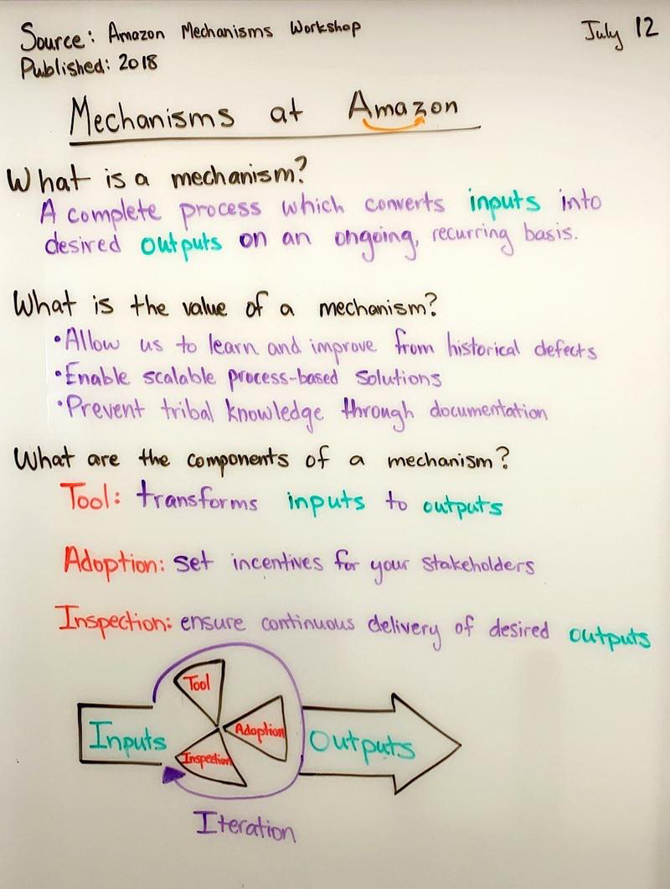
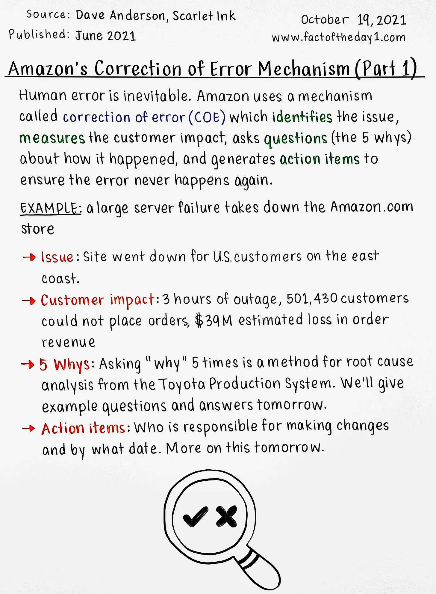
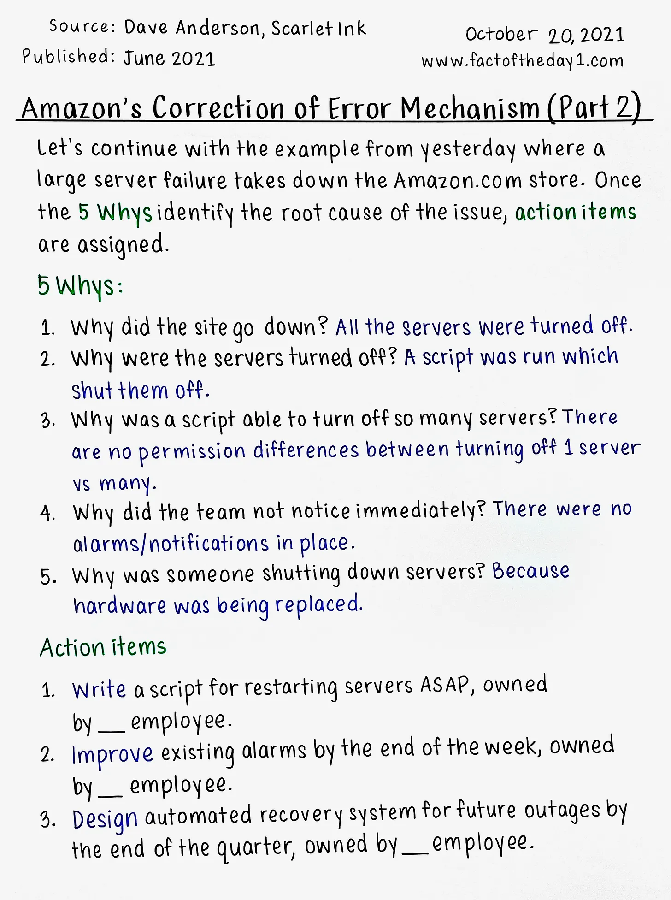

# 🔄 Mechanisms: Building Self-Correcting Systems

After years of watching teams struggle with the same problems repeatedly, I've learned that sustainable improvement requires more than good intentions. It requires **mechanisms**—self-correcting systems that turn inputs into measurable outputs through continuous iteration.

This post shares a framework I've used to transform chaotic engineering processes into predictable, improving systems. Whether you're debugging production issues or shipping new features, these principles apply.

Mechanisms represent the "Process" component of the [People-Process-Technology triad](../Culture/People_-_Process_-_Technology_Triad.md)—they're how you systematically enable people to do their best work.

## Table of Contents

- [What is a Mechanism?](#what-is-a-mechanism)
- [Why Mechanisms Matter: The Behavioral Shift](#why-mechanisms-matter-the-behavioral-shift)
- [The Anatomy of Effective Mechanisms](#the-anatomy-of-effective-mechanisms)
- [Example: From Prototype to Production](#example-from-prototype-to-production)
- [The COE (Correction of Error) Framework](#the-coe-correction-of-error-framework)
- [Building Your First Mechanism](#building-your-first-mechanism)
- [Common Pitfalls and How to Avoid Them](#common-pitfalls-and-how-to-avoid-them)
- [Making Mechanisms Stick](#making-mechanisms-stick)

## What is a Mechanism?

A mechanism is a complete, self-improving process that transforms specific inputs into measurable outputs. Unlike one-off fixes or heroic efforts, mechanisms create sustainable change through:

- **Defined inputs**: What activities or data feed the system?
- **Clear transformation**: How do inputs become outputs?
- **Measurable outputs**: What business results are we driving?
- **Inspection loops**: How do we learn and improve each cycle?

Think of mechanisms as the engineering mindset applied to organizational problems. Just as we build monitoring and alerting into production systems, we build feedback loops into our processes.

<details>
<summary><strong>Source of Inspiration →</strong></summary>

Source: [tipoftheday.com](http://tipoftheday.com) Amazon employees have a generally easier time embracing these concepts because it's been codified into their job levels and expectations for decades, and, quite importantly, this mindset aligns well with their fundamental concept of "working backwards from the customer." You have an opportunity in your organization to leverage some or all of this approach to help you scale.



</details>

## Why Mechanisms Matter: The Behavioral Shift

The real power of mechanisms isn't just in the processes—it's in how they transform team behavior. Here's what I've seen happen repeatedly:

<details>
<summary><strong>Click to see the transformation mechanisms enable →</strong></summary>

| **Replace** | **With** | **Expectation** |
|:------------|:---------|:----------------|
| "Trying harder" | Quantifiable goals, feedback loops to measure progress, periodic review, periodic assessment. | Increasingly reliable data, continuous improvement cycles with iterative changes, quantifiable results |
| Frustration and "learned helplessness" at not knowing where to begin | Problem framing followed by an engineering mindset focused on inputs and outputs. Identify stakeholders up-front. | Stakeholder team members take ownership for driving solutions. Alignment across our organization toward common goals. |
| Blaming others | Identifying stakeholders, prioritizing expected effort / goals / outcomes | Realistic, balanced perspective on what our options are, what's possible, and what we can do about things |
| Surveys and qualitative data | Metrics and automation | Deep insights into what our customers need |

</details>

This isn't theoretical—I've watched these transformations happen at companies from startups to Fortune 100s. The shift from "trying harder" to systematic improvement is profound.

## The Anatomy of Effective Mechanisms

Every successful mechanism I've built or observed shares these components:

```
Inputs → [Process + Tools + Adoption + Inspection] → Outputs
         ↑                                            ↓
         └──────────── Iteration Loop ←───────────────┘
```

### Key Elements

**1. End-to-End Ownership**  
Someone must own the entire flow, not just pieces. Split ownership = split results. For more on sustainable operational ownership, see [The Myth of Hypercare](../Culture/The_Myth_of_Hypercare.md).

**2. Quantifiable Goals**  
"Improve quality" isn't a mechanism. "Reduce P2 bugs by 35% in Q2" is.

**3. Regular Inspection**  
* Weekly or bi-weekly reviews prevent drift and surface improvement opportunities.
* Monthly cross-team reviews serve as a healthy forcing function for teams to share progress and struggles with stakeholders. This type of feedback loop can inform resourcing decisions and correct delivery schedules.

**4. Stakeholder Alignment**  
Everyone affected must understand their role and the expected outcomes.

<details>
<summary><strong>Click to see an example →</strong></summary>

## Example: From Prototype to Production

Let me share a fictitious example of building a mechanism for a conversational AI bot deployment:

### The Challenge
We had a chatbot prototype showing promise in demos but struggling with real customer interactions. The team kept saying "we need to improve it" without clear direction.

### The Mechanism We Built

**Goal**: Achieve 85% successful conversation completion rate before production launch

**Inputs**:
- Daily conversation logs
- User feedback forms
- Engineering bug reports
- Performance metrics

**Process**:
1. **Week 1-2**: Establish baseline metrics with 50 beta users
2. **Week 3-4**: Expand to 200 users, categorize failure modes
3. **Week 5-8**: Fix top issues, measure improvement
4. **Week 9-10**: Final validation with 500 users

**Tools**:
- Custom dashboard showing real-time success rates
- Automated classification of conversation failures
- Jira integration for bug tracking with SLA targets

**Inspection**:
- Daily standup reviewing previous day's metrics
- Weekly deep-dive on failure patterns
- Bi-weekly stakeholder review with go/no-go decisions

**Results**:
- Started at 62% success rate
- Reached 89% after 10 weeks
- Identified 3 fundamental issues we'd never have found without systematic data
- Launched with confidence backed by data, not hope

</details>


## The COE (Correction of Error) Framework

One of the most powerful mechanisms I've encountered is Amazon's COE process. It transforms failures into systematic improvements:

### How COE Works

1. **Incident Occurs**: Production issue impacts customers
2. **Immediate Response**: Fix the problem, restore service
3. **Deep Dive**: Within 24-48 hours, conduct root cause analysis
4. **Document Findings**: Write up what happened, why, and impact
5. **Action Items**: Define specific preventive measures with owners and dates
6. **Follow Through**: Track completion of all action items
7. **Pattern Analysis**: Quarterly review of all COEs to find systemic issues

### Why COE Works

- **Blameless**: Focus on systems, not people
- **Actionable**: Every COE produces concrete improvements
- **Transparent**: Shared learning across the organization
- **Measurable**: Track repeat incidents and time-to-resolution

### Visual Examples from Amazon's COE Process

| **Day 1: The Wheel of Blame** | **Day 2: The Path Forward** |
|:------------------------------|:----------------------------|
| [[source](https://www.factoftheday1.com/p/october-19-amazons-correction-of?utm_source=%2Fsearch%2FCOE&utm_medium=reader2)]<br/> | [[source](https://www.factoftheday1.com/p/october-20-amazons-correction-of?utm_source=%2Fsearch%2FCOE&utm_medium=reader2)]<br/> |

📖 **Learn More**: [Amazon's Approach to Failing Successfully](https://aws.amazon.com/builders-library/amazon-approach-to-failing-successfully/)

## Building Your First Mechanism

Start small with a problem that's been frustrating your team. Here's a template:

**Important**: Before designing any mechanism, be clear about [what vs. how](Understanding_What_vs_How.md)—define the outcome you want before choosing the process to achieve it.

### 1. Pick Your Problem
Choose something specific and measurable:
- ❌ "Code reviews take too long"
- ✅ "Average PR review time exceeds 2 days"

### 2. Define Success
What does "fixed" look like?
- Target metric (e.g., <4 hour review time)
- By when (e.g., end of Q2)
- For whom (e.g., 90% of PRs)

### 3. Design the Loop
- **Input**: What triggers the process?
- **Process**: What steps transform input to output?
- **Inspection**: How often do you review progress?
- **Adjustment**: How do you incorporate learnings?

### 4. Start Simple
Your first version won't be perfect. That's the point—mechanisms improve through iteration.

## Common Pitfalls and How to Avoid Them

### Pitfall 1: Mechanism Theater
**Symptom**: Going through motions without real improvement  
**Fix**: Tie mechanisms to business metrics, not activity metrics

### Pitfall 2: Set and Forget
**Symptom**: Initial enthusiasm followed by abandonment  
**Fix**: Schedule recurring reviews in everyone's calendar upfront

### Pitfall 3: Over-Engineering
**Symptom**: Spending months designing the perfect mechanism  
**Fix**: Launch v1 in 2 weeks, iterate based on data

### Pitfall 4: Lack of Ownership
**Symptom**: "Someone should look into this"  
**Fix**: Single owner with authority to make changes

## Making Mechanisms Stick

The difference between mechanisms that transform organizations and those that become shelf-ware:

### 1. Executive Sponsorship
Get senior leaders to buy in to the outputs, not just the process.

### 2. Visible Metrics
Automated alerts for team on-calls > dashboard on in-office screens > report in email > nothing

### 3. Celebrate Improvements
When cycle time drops 50%, make it known. Success breeds continued adoption and confidence.

### 4. Regular Pruning
Retire mechanisms that no longer serve their purpose. Not every mechanism is forever. Not every mechanism requires replacement with a better one.

### 5. Cultural Integration
The best mechanisms become "how we do things here" rather than extra work.

## From Chaos to Clarity

I've seen mechanisms transform:
- A team drowning in production issues into teams that prevent them
- A 3-month waterfall feature cycle into a 2-week continuous delivery machine
- A culture of blame into a proud culture of humble, grounded continuous improvement

The beauty of mechanisms is their compounding effect. Each iteration makes the team smarter and the next iteration easier. Problems that initially seemed intractable become solvable when you apply systematic thinking and rigorous measurement.

Start with one problem. Build one mechanism. Measure the results. The hardest part isn't designing the perfect system—it's starting with an imperfect one and improving it every week.

**Documentation tip**: When documenting your mechanisms for others to understand and adopt, use the [professional writing techniques](../Culture/Professional_Writing_Tips.md) that make complex processes clear and actionable.

**Observability tip**: Most effective mechanisms require measurement to validate their impact. See [What Dashboards Are Good For](../EngFundamentals/What_Dashboards_are_Good_For.md) for building monitoring that supports continuous improvement.

## Additional Reading

### Continuous Improvement Foundations
- **[The Toyota Way by Jeffrey Liker](https://www.lean.org/the-lean-library/the-toyota-way/)** - Original framework for continuous improvement and systematic problem-solving
- **[The Lean Startup by Eric Ries](http://theleanstartup.com/)** - Build-measure-learn cycles applied to product development
- **[The Goal by Eliyahu Goldratt](https://www.toc-goldratt.com/en/product/The-Goal-A-Process-of-Ongoing-Improvement)** - Theory of constraints and systematic bottleneck identification

### Engineering Process Excellence
- **[Accelerate by Nicole Forsgren, Jez Humble, and Gene Kim](https://itrevolution.com/book/accelerate/)** - Research-backed insights on high-performing technology organizations
- **[The DevOps Handbook by Gene Kim](https://itrevolution.com/book/the-devops-handbook/)** - Practical guide to building improvement mechanisms in technology organizations
- **[Google SRE Book: Monitoring Distributed Systems](https://sre.google/sre-book/monitoring-distributed-systems/)** - Essential framework for building measurable, improvable systems

---

*Have your own templates or hard-won lessons? I'd love to hear them. Drop a comment or [open an issue](https://github.com/bordenet/Engineering_Culture/issues/new) to share.*