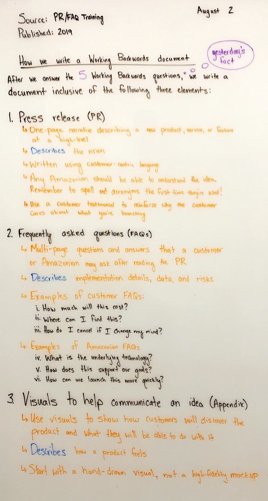
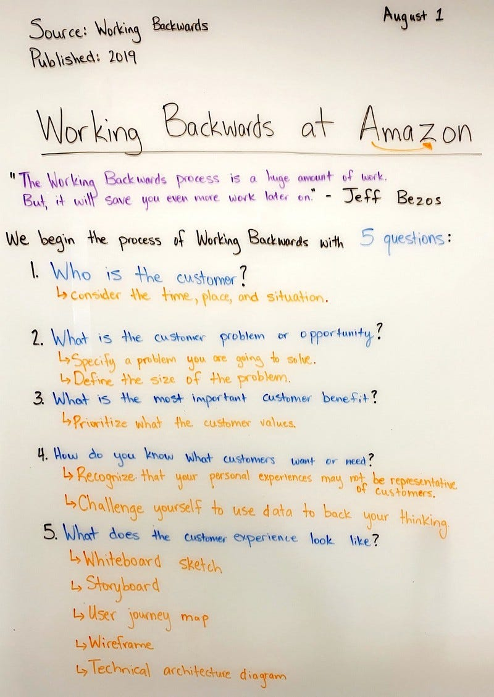

# 📰 Project Planning: The PR-FAQ Mechanism
> _a.k.a. Amazon's "Working Backwards" Approach to Product Development_. Some things are worth copying.

> [!NOTE]
> Read more about [mechanisms](./Mechanisms:_Building_Self-Correcting_Systems.md)

After years of watching teams build the wrong thing perfectly, I've become an advocate for selective use of the Press Release-FAQ methodology. Originally developed at Amazon but now adopted across the industry, this technique forces teams to define success from the customer's perspective before writing a [Product Requirements Doc](./Project_Planning_Mechanisms%3A_Documents.md#prd-the-what-and-why) or a single line of code.

But here's the thing: **most projects don't need a PR-FAQ**. This post will help you understand when to use this powerful but deceptively heavy-duty tool, and how to do it effectively.

## Table of Contents

- [What is a PR-FAQ?](#what-is-a-pr-faq)
- [When to Use (and Not Use) PR-FAQs](#when-to-use-and-not-use-pr-faqs)
- [The Working Backwards Philosophy](#the-working-backwards-philosophy)
- [Writing the Press Release](#writing-the-press-release)
- [Crafting Effective FAQs](#crafting-effective-faqs)
- [Common Mistakes and How to Avoid Them](#common-mistakes-and-how-to-avoid-them)
- [Making PR-FAQs Work in Your Organization](#making-pr-faqs-work-in-your-organization)
- [Templates and Examples](#templates-and-examples)

## What is a PR-FAQ?

A PR-FAQ is exactly what it sounds like: a press release for a product that doesn't exist yet, followed by an FAQ addressing likely questions from customers and stakeholders. While the format seems simple, the discipline required to write an effective PR-FAQ has can save teams from countless expensive missteps.

The magic? By forcing you to articulate customer value in plain English, it exposes fuzzy thinking before you've invested months in development.

> [!WARNING]
> The PR-FAQ process is almost always overkill for small-scale projects. Use sparingly!

> [!WARNING]
> The PR-FAQ is not a replacement for a [Product Requirements Document](./Project_Planning_Mechanisms%3A_Documents.md#prd-the-what-and-why), though it's a best-practice to cite references to the Feature Spec in the FAQ section and Appendices, where appropriate.

## When to Use (and Not Use) PR-FAQs

### ✅ Use PR-FAQs For:
- New products or major features with unclear customer value
- Initiatives requiring significant investment (6+ months, 10+ people)
- Projects where alignment across multiple teams is critical
- When you need to validate "should we build this?" not just "can we?"

### ❌ Skip PR-FAQs For:
- Bug fixes or performance improvements
- Features with obvious customer value
- Small iterations on existing products
- When the team already has strong alignment

A simple test: If writing the press release feels forced or artificial, you probably don't need one.

## The Working Backwards Philosophy

The core insight of working backwards: Start with the customer experience and work backwards to the technology, not the other way around. This reversal of typical engineering thinking has consistently revealed when my teams were solving interesting technical problems that weren't actually customer problems.

<strong>Visual Framework for Working Backwards →</strong>

|  **PR-FAQ Document Structure** | **5 Working Backwards Questions** | **5 Stages of Working Backwards** |
|:-------------------------------|:----------------------------------|:----------------------------------|
|  |  |  |
| [Source](https://www.factoftheday1.com/p/how-we-write-a-working-backwards-document-f39c2fde5a73) | [Source](https://www.factoftheday1.com/p/working-backwards-at-amazon-a303c3680aa3) | [Source](https://www.factoftheday1.com/p/august-4-5-stages-of-working-backwards) |

## Writing the Press Release

The press release should read like something TechCrunch would actually publish. If you're straining to make it exciting, you might be solving the wrong problem.

### PR Template Structure

| **Section** | **Description** |
|:------------|:----------------|
| **Heading** | Name the product in a way your target customers will understand |
| **Sub-Heading** | Single sentence describing the market and primary benefit |
| **Summary** | One paragraph that would make someone want to read more. Use plain language—no jargon! |
| **Problem** | What customer pain point are you addressing? Make it relatable. |
| **Solution** | How your product elegantly solves the problem |
| **Company Quote** | Why your company is uniquely positioned to deliver this |
| **How to Get Started** | Dead simple explanation of first steps |
| **Customer Quote** | Hypothetical but realistic customer testimonial |
| **Call to Action** | Where readers go to learn more |

### Writing Tips

- **Keep it to one page** when printed
- **Write for your neighbor**, not your engineering team
- **Focus on benefits**, not features
- **Use concrete examples** rather than abstractions
- **Avoid [weasel words](../Culture/Weasel_Words.md)** that obscure meaning—be specific about customer value

For comprehensive guidance on professional writing techniques, see [Professional Writing for Engineers](../Culture/Professional_Writing_Tips.md).

If the press release doesn't generate genuine excitement from readers, either:
1. The problem isn't significant enough
2. Your solution isn't compelling enough
3. You haven't articulated the value clearly

## Crafting Effective FAQs

The FAQ section is where you address the hard questions and hidden assumptions. This is often more valuable than the press release itself.

### Two-Part FAQ Structure

| **Section** | **Purpose** |
|:------------|:------------|
| **External FAQ** | Questions customers would ask. Written as if it's public documentation. Include wireframes or mockups here if helpful. |
| **Internal FAQ** | The "[rude Q&A](https://critter.blog/2022/10/20/the-rude-qa/)"—hard questions your team will ask about feasibility, resources, risks, and trade-offs. |

### Effective Internal FAQ Topics

- **Scope boundaries**: What's explicitly NOT in v1?
- **Resource requirements**: Team size, timeline, dependencies
- **Technical risks**: What could derail the project?
- **Market assumptions**: What needs to be true for success?
- **Success metrics**: How will we measure impact?
- **Integration points**: Which teams need to be involved?

> [!IMPORTANT]
> The FAQ section is a living document, intended to collect updates throughout the project.

## Common Mistakes and How to Avoid Them

### Mistake 1: Writing a Feature List
**Problem**: "Our product has X, Y, and Z capabilities..."  
**Fix**: Focus on customer outcomes: "Customers can now accomplish..."

### Mistake 2: Technical Jargon
**Problem**: "Leveraging our microservices architecture..."  
**Fix**: "Start using the product in under 5 minutes..."

### Mistake 3: Vague Benefits
**Problem**: "Improves productivity"  
**Fix**: "Reduces report generation from 2 hours to 5 minutes"

### Mistake 4: Writing in Isolation
**Problem**: PM writes PR-FAQ alone, presents to team  
**Fix**: Collaborate early with engineering, design, and key stakeholders

### Mistake 5: Treating it as a Spec
**Problem**: Including implementation details, API designs. This is _the worst_ thing to do.
**Fix**: Stay focused on customer experience and outcomes. Do your full job and write a proper PRD if the PR-FAQ passes muster.

## Making PR-FAQs Work in Your Organization

### The Review Process

1. **Draft with core team** (PM, Tech Lead, Designer)
2. **Get feedback from 3-5 stakeholders** before broad review
3. **Hold a structured review meeting**—no slides allowed! (I loathe PowerPoint slides!)
4. **Iterate based on feedback** until excitement is genuine
5. **Use throughout project** for onboarding and course correction

### Cultural Considerations

Not every organization is ready for PR-FAQs. I've seen them fail spectacularly in cultures that lack the discipline to apply this degree of rigor. They work best when:
- Leadership values customer focus over technical elegance
- Teams have autonomy to say "no" to bad ideas
- There's psychological safety to ask hard questions
- Writing and clear thinking are valued skills

### Making the Investment Worth It

Prior to the advent of LLMs, a good PR-FAQ often required 10+ hours to write well. I used to budget a full day for the iterative process. (Hey-- I'm an engineer, not a public relations expert!) LLMs changed the game-- it's become trivial to create a poor one with little value—the thinking is still the hard part.
- Using it to onboard every new team member
- Reviewing it monthly to catch scope creep
- Referencing it in architectural decisions
- Celebrating when you deliver what you promised

## Templates and Examples

### Real-World Examples
- **[SVPGs Example PR-FAQ](https://www.svpg.com/example-prfaq/)** - Clean, simple format
- **[Amazon Prime Pantry PR-FAQ](https://canvas.upenn.edu/courses/1529286/assignments/8420547)** - More detailed example

### Additional Resources
- **[Working Backwards Book](https://www.workingbackwards.com/)** - The definitive guide by Amazon insiders
- **[Medium: PR-FAQs for Product Managers](https://medium.com/agileinsider/press-releases-for-product-managers-everything-you-need-to-know-942485961e31)** - Opinionated take
- **[Product Strategy: Amazon PR-FAQ Guide](https://productstrategy.co/working-backwards-the-amazon-prfaq-for-product-innovation/)** - Practical tips
- **[Coda Template](https://coda.io/@colin-bryar/working-backwards-how-write-an-amazon-pr-faq)** - Interactive template

## The Bottom Line

PR-FAQs are a powerful tool for ensuring you build the right thing. But like any powerful tool, they can be misused. Use them when:
- The customer value isn't obvious
- Multiple teams need alignment
- The investment is significant
- Failure would be costly

Skip them when the path forward is clear and the stakes are low.

The hardest part isn't writing the document—it's having the courage to kill projects when the PR-FAQ reveals they're not worth pursuing. That's also where the greatest value lies: failing fast and cheap on paper rather than slow and expensive in production.

## Additional Reading

These authoritative sources provide deeper insights into the PR-FAQ methodology and working backwards philosophy:

- **"Working Backwards: Insights, Stories, and Secrets from Inside Amazon"** by Colin Bryar and Bill Carr - The definitive guide written by Amazon insiders who helped develop the PR-FAQ process, offering detailed frameworks and real examples from inside the company.

- **"The Everything Store: Jeff Bezos and the Age of Amazon"** by Brad Stone - Essential context on Amazon's customer-obsessed culture that gave birth to working backwards, showing how radical customer focus shapes product development.

- **"Good Strategy Bad Strategy"** by Richard Rumelt - Foundational reading on strategic thinking that complements PR-FAQ methodology, particularly valuable for understanding how to identify and articulate compelling customer problems.

- **"The Lean Startup"** by Eric Ries - Provides the theoretical foundation for hypothesis-driven product development that underlies the PR-FAQ's emphasis on validating assumptions before building.

- **"Inspired: How to Create Tech Products Customers Love"** by Marty Cagan - Industry-standard guide to product management that reinforces customer-centric development principles and offers complementary frameworks for product discovery.

- **"The Mom Test"** by Rob Fitzpatrick - Practical guide to customer validation techniques that pairs perfectly with PR-FAQ development, helping teams understand whether their press release assumptions reflect real customer needs.

---

*Have your own templates or hard-won lessons? I'd love to hear them. Drop a comment or [open an issue](https://github.com/bordenet/Engineering_Culture/issues/new) to share.*

*More engineering leadership insights will be forthcoming. Check back soon!*
