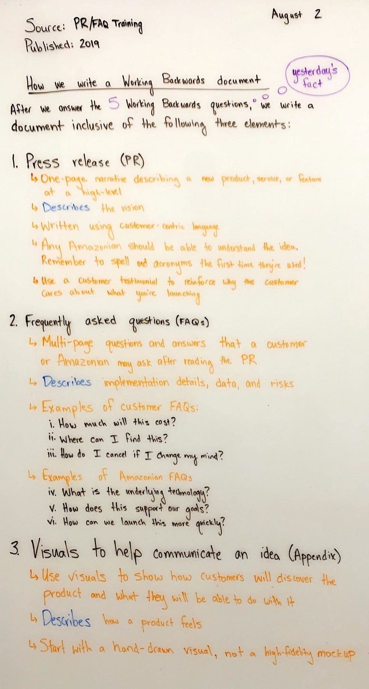
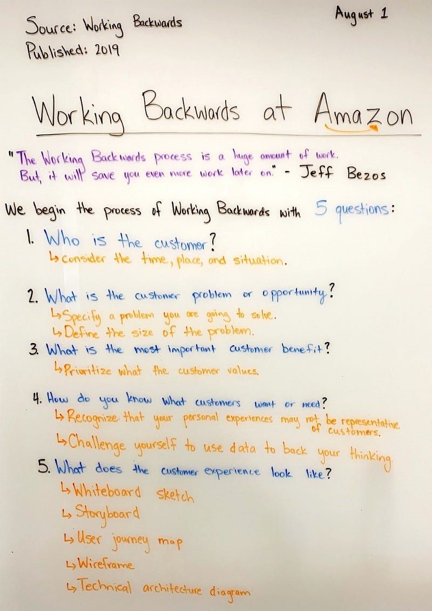
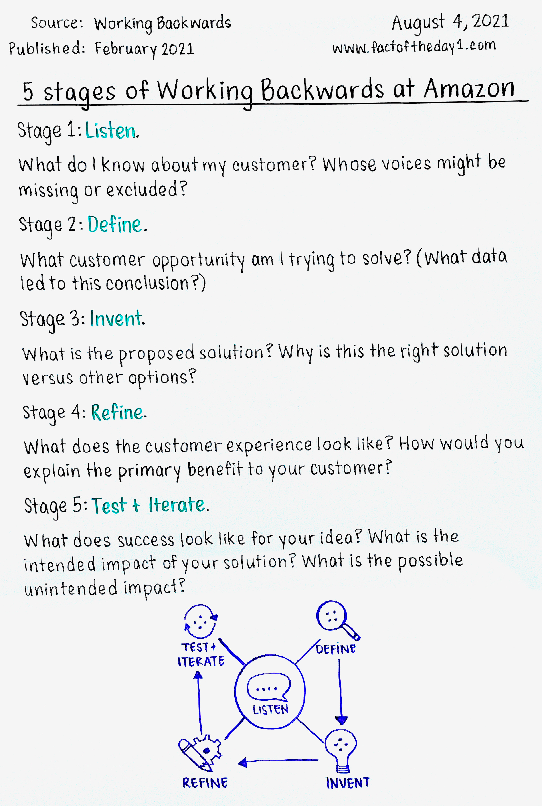

# Project Planning: The PR-FAQ Mechanism
> _a.k.a. Amazon's "Working Backwards" Approach to Product Development_

> [!NOTE]
> * Read more about [mechanisms](./Mechanisms:_Building_Self-Correcting_Systems.md)
> * Generate PR-FAQs with [pr-faq-assistant](https://bordenet.github.io/pr-faq-assistant/) ([repo](https://github.com/bordenet/pr-faq-assistant))
> * Validate your PR-FAQ with the [pr-faq-validator](https://github.com/bordenet/pr-faq-validator) tool

Amazon's PR-FAQ (Press Release / Frequently Asked Questions) mechanism forces teams to define success from the customer's perspective before writing a single line of code. By articulating customer value in plain, journalistic English, it exposes weak thinking before you've invested months in development.

**But here's the thing: most projects don't need a PR-FAQ.** This guide covers when to use this tool and how to write one that scores well.

## Table of Contents

- [What is a PR-FAQ?](#what-is-a-pr-faq)
- [When to Use (and Not Use) PR-FAQs](#when-to-use-and-not-use-pr-faqs)
- [The Working Backwards Philosophy](#the-working-backwards-philosophy)
- [Writing the Press Release](#writing-the-press-release)
  - [The Newsworthy Opening](#the-newsworthy-opening)
  - [The 5 Ws: Journalism 101](#the-5-ws-journalism-101)
  - [Writing Headlines That Work](#writing-headlines-that-work)
  - [Customer Quotes That Matter](#customer-quotes-that-matter)
  - [Words to Avoid](#words-to-avoid)
- [PR-FAQ Quality Checklist](#pr-faq-quality-checklist)
- [Crafting Effective FAQs](#crafting-effective-faqs)
- [Complete Annotated Example](#complete-annotated-example)
- [Common Mistakes and How to Avoid Them](#common-mistakes-and-how-to-avoid-them)
- [Making PR-FAQs Work in Your Organization](#making-pr-faqs-work-in-your-organization)
- [Templates and Resources](#templates-and-resources)

## What is a PR-FAQ?

A PR-FAQ is a fictitious press release for a product that doesn't exist yet, followed by an FAQ addressing likely questions from stakeholders. The format seems simple, but writing an effective PR-FAQ requires discipline that saves teams from building the wrong thing.

> [!WARNING]
> The PR-FAQ process is overkill for small-scale projects. Use sparingly.

> [!WARNING]
> The PR-FAQ is not a replacement for a [Product Requirements Document](./Project_Planning_Mechanisms%3A_Documents.md#prd-the-what-and-why). It validates *what* to build; the PRD specifies *how* to build it.

## When to Use (and Not Use) PR-FAQs

### ✅ Use PR-FAQs For:
- New products or major features with unclear customer value
- Initiatives requiring significant investment (6+ months, 10+ people)
- Projects where alignment across multiple teams is critical
- When you need to validate "should we build this?" not just "can we?"

### ❌ Skip PR-FAQs For:
- Bug fixes or performance improvements
- Features with obvious customer value
- Small iterations on existing products
- When the team already has strong alignment

**A simple test:** If writing the press release feels forced or artificial, you probably don't need one.

## The Working Backwards Philosophy

Start with the customer experience and work backwards to the technology, not the other way around. This reversal reveals when teams are solving interesting technical problems that aren't actually customer problems.

<details>
<summary><strong>Visual Framework for Working Backwards →</strong></summary>

|  **PR-FAQ Document Structure** | **5 Working Backwards Questions** | **5 Stages of Working Backwards** |
|:-------------------------------|:----------------------------------|:----------------------------------|
|  |  |  |
| [Source](https://www.factoftheday1.com/p/how-we-write-a-working-backwards-document-f39c2fde5a73) | [Source](https://www.factoftheday1.com/p/working-backwards-at-amazon-a303c3680aa3) | [Source](https://www.factoftheday1.com/p/august-4-5-stages-of-working-backwards) |

</details>

## Writing the Press Release

The press release should read like something TechCrunch would actually publish. This means following journalistic conventions. If you're straining to make it exciting, you might be solving the wrong problem.

### The Newsworthy Opening

Every press release opens with a dateline and hook. This isn't optional.

**The Formula:**
```
CITY, STATE — Date — Company X today announced [significant outcome]...
```

**Examples:**

❌ **Weak opening:**
> "We're excited to announce our new product that will help teams work better."

✅ **Strong opening:**
> "SAN FRANCISCO, January 15, 2026 — Acme Corp today announced the launch of WorkFlow Pro, reducing project delivery time by 40% for enterprise teams."

The opening paragraph should immediately convey:
- **Who** is making the announcement
- **What** they're announcing
- **Why** anyone should care (the measurable benefit)

### The 5 Ws: Journalism 101

Every press release must answer the **5 Ws** in the first few paragraphs. This is fundamental journalism.

| **W** | **Question** | **Example** |
|-------|--------------|-------------|
| **WHO** | Who is the company/organization? | "Acme Corp, a provider of enterprise workflow solutions..." |
| **WHAT** | What product/service/action? | "...today announced WorkFlow Pro, an AI-powered project management platform..." |
| **WHEN** | When is this happening? | "...available starting February 1, 2026..." |
| **WHERE** | Where is this relevant? | "...for enterprise teams across North America and Europe..." |
| **WHY** | Why does this matter? | "...addressing the $50B annual cost of project delays in enterprise software development." |

> [!TIP]
> **Self-check:** After writing your opening paragraphs, highlight where you answer each W. If any are missing, your press release is incomplete.

### Writing Headlines That Work

Your headline is the first thing readers see. It must be specific and action-oriented.

**Headline Guidelines:**

| **Guideline** | **Why** | **Example** |
|---------------|---------|-------------|
| Use strong action verbs | Creates clarity | Launches, Announces, Unveils, Introduces, Releases |
| Target 8-15 words | Long enough to be specific, short enough to scan | ✅ |
| Include measurable outcomes | Proves value | "...Reducing Review Time by 75%" |
| Name the product clearly | Readers should know what this is about | ✅ |
| Avoid marketing fluff | Credibility matters | See [Words to Avoid](#words-to-avoid) |

**Examples:**

❌ **Weak headlines:**
- "New Product Announcement" *(too vague)*
- "Revolutionary AI-Powered Game-Changing Platform Disrupts Industry" *(fluff-filled)*
- "We Made Something Cool" *(unprofessional)*

✅ **Strong headlines:**
- "Acme Corp Launches WorkFlow Pro, Reducing Project Delivery Time by 40%"
- "DataSync Introduces Real-Time Analytics Platform for Healthcare Providers"
- "CloudFirst Unveils Cost Optimization Tool, Saving Enterprise Customers $2M Annually"

### Customer Quotes That Matter

Most PR-FAQ customer quotes are useless. They say things like "This product is great!" which adds nothing. Good quotes include **specific, quantitative metrics** that prove value.

**The Formula for Effective Quotes:**

```
"[Specific outcome with numbers]," said [Name], [Title] at [Company]. 
"[Additional context or secondary metric]. [Forward-looking statement]."
```

**Examples:**

❌ **Weak quote (no metrics):**
> "This tool is amazing and has really helped our team work better. We love it!"

❌ **Weak quote (vague metrics):**
> "We've seen significant improvements in productivity since adopting this solution."

✅ **Strong quote (specific metrics):**
> "Our document review cycles dropped from 12 hours across 4 rounds to just 3 hours in 2 rounds," said Sarah Chen, Senior Product Manager at TechStart Inc. "Stakeholder approval rates jumped from 60% to 95%, saving our team 120 hours last quarter."

✅ **Strong quote (multiple metric types):**
> "We reduced processing time by 40% and increased accuracy from 85% to 99.7%," said Marcus Johnson, VP of Engineering at DataFlow Systems. "Our executive reviews are now 3x faster, and we've cut costs by $50K per quarter."

**Metrics to Include in Quotes:**

| **Metric Type** | **Examples** |
|-----------------|--------------|
| Percentages | "reduced by 40%", "improved 95%", "increased from 60% to 95%" |
| Time savings | "cut from 12 hours to 3 hours", "saves 20 hours per week" |
| Cost savings | "reduced costs by $50K", "saves $2M annually" |
| Scale improvements | "processes 10x more data", "handles 3x the volume" |
| Ratios | "3x faster", "5x more efficient" |

> [!IMPORTANT]
> **Aim for 2-4 customer quotes**, each with at least 2-3 specific metrics. More than 4 quotes dilutes impact; fewer than 2 lacks social proof.

### Words to Avoid

Marketing fluff undermines credibility. These words signal that you're selling rather than informing:

| **🚫 Avoid** | **✅ Replace With** |
|--------------|---------------------|
| Revolutionary | Specific improvement: "reduces time by 40%" |
| Game-changing | Concrete outcome: "eliminates manual review" |
| Cutting-edge | Specific capability: "uses GPT-4 for analysis" |
| Best-in-class | Comparative data: "outperforms alternatives by 2x" |
| World-class | Customer evidence: "trusted by 500+ enterprises" |
| Innovative | What it actually does: "automatically detects..." |
| Disruptive | Market impact: "addresses $50B problem" |
| Seamless | User experience: "requires no configuration" |
| Robust | Specific capability: "handles 10M requests/day" |
| Leverage/Synergy | Plain English: "uses", "combines" |
| Excited to announce | Just announce it: "today announced" |

> [!TIP]
> **The "So What?" Test:** After every sentence, ask "So what?" If the answer requires vague words like "innovative" or "revolutionary," you haven't been specific enough.

## PR-FAQ Quality Checklist

Use this checklist to self-evaluate before sharing your PR-FAQ. This mirrors what the [pr-faq-validator](https://github.com/bordenet/pr-faq-validator) tool scores.

### Structure & Hook (30 points)

- [ ] **Headline** (10 pts)
  - [ ] Uses strong action verb (Launches, Announces, Unveils, etc.)
  - [ ] 8-15 words in length
  - [ ] Includes specific outcome or metric
  - [ ] Names the product/company clearly
  - [ ] Avoids marketing fluff

- [ ] **Newsworthy Opening** (15 pts)
  - [ ] Opens with dateline (CITY, Date)
  - [ ] First sentence includes measurable outcome
  - [ ] Clearly identifies the company and action
  - [ ] Addresses a clear problem or improvement
  - [ ] Avoids marketing fluff in hook

- [ ] **Release Date** (5 pts)
  - [ ] Includes specific date in opening
  - [ ] Follows standard press release format

### Content Quality (35 points)

- [ ] **5 Ws Coverage** (15 pts)
  - [ ] WHO: Company clearly identified
  - [ ] WHAT: Product/action clearly described
  - [ ] WHEN: Timing/availability stated
  - [ ] WHERE: Market/geography mentioned
  - [ ] WHY: Customer benefit explained

- [ ] **Credibility** (10 pts)
  - [ ] Includes supporting details and context
  - [ ] Claims backed by data or evidence
  - [ ] Avoids vague, unsubstantiated claims

- [ ] **Structure** (10 pts)
  - [ ] Logical flow with transitions
  - [ ] Appropriate length (1 page when printed)
  - [ ] Company boilerplate included

### Professional Quality (20 points)

- [ ] **Tone & Readability** (10 pts)
  - [ ] Written for general audience, not engineers
  - [ ] Uses active voice
  - [ ] Avoids unnecessary jargon
  - [ ] Sentences are clear and concise

- [ ] **Fluff Avoidance** (10 pts)
  - [ ] No "revolutionary", "game-changing", etc.
  - [ ] No "excited to announce"
  - [ ] Specific rather than vague claims
  - [ ] Professional, journalistic tone

### Customer Evidence (15 points)

- [ ] **Quote Quality** (15 pts)
  - [ ] 2-4 customer quotes included
  - [ ] Each quote contains specific metrics
  - [ ] Metrics include percentages, time, cost, or scale
  - [ ] Quotes attributed to named individuals with titles
  - [ ] Quotes provide substantive insight, not just praise

**Scoring Guide:**
- **80-100:** Publication-ready
- **60-79:** Good foundation, needs targeted improvements  
- **40-59:** Gaps to address
- **Below 40:** Major rework needed

## Crafting Effective FAQs

The FAQ section addresses hard questions and hidden assumptions. Often more valuable than the press release itself.

### Two-Part FAQ Structure

| **Section** | **Purpose** |
|:------------|:------------|
| **External FAQ** | Questions customers would ask. Written as if it's public documentation. Include wireframes or mockups here if helpful. |
| **Internal FAQ** | The "[rude Q&A](https://critter.blog/2022/10/20/the-rude-qa/)" — hard questions about feasibility, resources, risks, and trade-offs. |

### Essential Internal FAQ Topics

- **Scope boundaries:** What's explicitly NOT in v1?
- **Resource requirements:** Team size, timeline, dependencies
- **Technical risks:** What could derail the project?
- **Market assumptions:** What needs to be true for success?
- **Success metrics:** How will we measure impact?
- **Integration points:** Which teams need to be involved?
- **Competitive response:** How will competitors react?
- **Failure scenarios:** What happens if key assumptions are wrong?

> [!IMPORTANT]
> The FAQ section is a living document. Update it throughout the project as you learn.

## Complete Annotated Example

Below is a complete PR-FAQ example with annotations explaining why each element works.

---

### Example PR-FAQ: WorkFlow Pro

**HEADLINE**

> Acme Corp Launches WorkFlow Pro, Reducing Project Delivery Time by 40%

- ✓ Action verb: "Launches"
- ✓ Company named: "Acme Corp"
- ✓ Product named: "WorkFlow Pro"
- ✓ Specific metric: "40%"
- ✓ Length: 11 words (within 8-15 range)

**SUBHEADLINE**

> AI-powered project management platform helps enterprise teams ship faster with fewer resources

- ✓ Describes what it is: "AI-powered project management platform"
- ✓ Target audience: "enterprise teams"
- ✓ Benefits: "ship faster with fewer resources"

**OPENING PARAGRAPH**

> SAN FRANCISCO, February 1, 2026 — Acme Corp, a provider of enterprise software solutions, today announced the general availability of WorkFlow Pro, an AI-powered project management platform that reduces delivery time by 40% while cutting resource requirements by 25%.

- ✓ Dateline: "SAN FRANCISCO, February 1, 2026"
- ✓ WHO: "Acme Corp, a provider of enterprise software"
- ✓ WHAT: "WorkFlow Pro, an AI-powered project management platform"
- ✓ Measurable outcomes: "40%" and "25%"
- ✓ No fluff words

**PROBLEM PARAGRAPH**

> Enterprise software teams lose an estimated $50 billion annually to project delays, with the average project running 45% over schedule. Traditional project management tools require extensive manual updates and fail to predict bottlenecks before they impact delivery.

- ✓ WHY this matters: "$50 billion annually"
- ✓ Specific problem data: "45% over schedule"
- ✓ Clear pain point: "manual updates", "fail to predict"

**SOLUTION PARAGRAPH**

> WorkFlow Pro addresses these challenges through automated progress tracking, AI-powered bottleneck prediction, and intelligent resource allocation. The platform integrates with existing tools including Jira, GitHub, and Slack, requiring no changes to current workflows.

- ✓ Specific capabilities (not vague "features")
- ✓ Integration points
- ✓ Ease of adoption: "no changes to current workflows"

**CUSTOMER QUOTE #1**

> "Our release cycles dropped from 8 weeks to 5 weeks after implementing WorkFlow Pro," said Jennifer Martinez, VP of Engineering at CloudFirst Systems. "We identified and resolved bottlenecks 3x faster, and our on-time delivery rate improved from 62% to 94%."

- ✓ Named person with title and company
- ✓ Time savings: "8 weeks to 5 weeks"
- ✓ Ratio: "3x faster"
- ✓ Percentage improvement: "62% to 94%"
- ✓ Three distinct metrics in one quote

**CUSTOMER QUOTE #2**

> "The ROI was immediate," said David Park, CTO at FinanceFlow. "We reduced our project management overhead by 30%, saving approximately $400,000 annually. The AI predictions caught 85% of potential delays before they impacted our schedule."

- ✓ Cost savings: "30%", "$400,000 annually"
- ✓ Effectiveness metric: "85% of potential delays"
- ✓ Business impact clearly stated

**COMPANY QUOTE**

> "Enterprise teams have been forced to choose between speed and quality," said Sarah Chen, CEO of Acme Corp. "WorkFlow Pro eliminates that trade-off by giving teams visibility into their delivery pipeline and actionable recommendations to stay on track."

- ✓ Positions the company's vision
- ✓ Explains unique value proposition
- ✓ Professional tone (no "excited to announce")

**AVAILABILITY & CALL TO ACTION**

> WorkFlow Pro is available immediately for enterprise customers in North America and Europe, with Asia-Pacific availability planned for Q3 2026. Pricing starts at $50 per user per month, with volume discounts available. Teams can start a 30-day free trial at www.acmecorp.com/workflowpro.

- ✓ WHEN: "available immediately"
- ✓ WHERE: "North America and Europe"
- ✓ Pricing transparency
- ✓ Clear next step for readers

**BOILERPLATE**

> **About Acme Corp**
> Acme Corp provides enterprise software solutions that help teams deliver faster and more predictably. Founded in 2015 and headquartered in San Francisco, Acme serves over 500 enterprise customers including 50 Fortune 500 companies. For more information, visit www.acmecorp.com.

- ✓ Company background
- ✓ Credibility markers: "500 enterprise customers", "50 Fortune 500"
- ✓ Contact information

---

## Common Mistakes and How to Avoid Them

### Mistake 1: Writing a Feature List
**Problem:** "Our product has X, Y, and Z capabilities..."  
**Fix:** Focus on customer outcomes: "Customers can now accomplish..."

### Mistake 2: Vague Customer Quotes
**Problem:** "This product is amazing and really helps our team!"  
**Fix:** Add metrics: "Reduced review time by 75% and cut costs by $50K quarterly."

### Mistake 3: Missing the 5 Ws
**Problem:** Jumping into features without establishing context  
**Fix:** Use the checklist—ensure WHO, WHAT, WHEN, WHERE, WHY are answered in first 2 paragraphs

### Mistake 4: Marketing Fluff
**Problem:** "Revolutionary AI-powered game-changing platform..."  
**Fix:** Specific claims: "AI-powered platform that reduces delivery time by 40%..."

### Mistake 5: No Dateline
**Problem:** Starting with "We're excited to announce..."  
**Fix:** Standard format: "CITY, Date — Company today announced..."

### Mistake 6: Writing in Isolation
**Problem:** PM writes PR-FAQ alone, presents to team  
**Fix:** Collaborate early with engineering, design, and key stakeholders

### Mistake 7: Treating it as a Spec
**Problem:** Including implementation details, API designs  
**Fix:** Stay focused on customer experience. Write a proper PRD after the PR-FAQ passes muster.

### Mistake 8: Too Many Quotes
**Problem:** 6+ customer quotes diluting the message  
**Fix:** 2-4 focused quotes with strong metrics.

## Making PR-FAQs Work in Your Organization

### The Review Process

1. **Draft with core team** (PM, Tech Lead, Designer)
2. **Self-evaluate** against the [quality checklist](#pr-faq-quality-checklist)
3. **Get feedback from 3-5 stakeholders** before broad review
4. **Hold a structured review meeting** — no slides allowed
5. **Iterate based on feedback** until excitement is genuine
6. **Use throughout project** for onboarding and course correction

### Cultural Considerations

PR-FAQs work best when:
- Leadership values customer focus over technical elegance
- Teams can say "no" to bad ideas
- People can ask hard questions without repercussions
- Writing is valued as a skill

### Getting Value from the Investment

A good PR-FAQ requires real thinking time—the writing is the easy part. Get value from it by:
- Using it to onboard every new team member
- Reviewing it monthly to catch scope creep
- Referencing it in architectural decisions
- Celebrating when you deliver what you promised

## Templates and Resources

### Validate Your PR-FAQ
- **[pr-faq-validator](https://github.com/bordenet/pr-faq-validator)** — CLI tool that scores your PR-FAQ against journalistic standards

### Real-World Examples
- **[SVPG's Example PR-FAQ](https://www.svpg.com/example-prfaq/)** — Clean, simple format
- **[Amazon Prime Pantry PR-FAQ](https://canvas.upenn.edu/courses/1529286/assignments/8420547)** — More detailed example

### Books and Articles
- **[Working Backwards Book](https://www.workingbackwards.com/)** — The definitive guide by Amazon insiders
- **[Medium: PR-FAQs for Product Managers](https://medium.com/agileinsider/press-releases-for-product-managers-everything-you-need-to-know-942485961e31)** — Opinionated take
- **[Product Strategy: Amazon PR-FAQ Guide](https://productstrategy.co/working-backwards-the-amazon-prfaq-for-product-innovation/)** — Practical tips
- **[Coda Template](https://coda.io/@colin-bryar/working-backwards-how-write-an-amazon-pr-faq)** — Interactive template

## The Bottom Line

PR-FAQs force you to think through customer value before building. Remember:

1. **Follow journalistic conventions** — dateline, 5 Ws, newsworthy hook
2. **Be specific with metrics** — especially in customer quotes
3. **Avoid marketing fluff** — credibility over hype
4. **Use the checklist** — catch gaps before review

The hardest part isn't writing—it's killing projects when the PR-FAQ reveals they're not worth pursuing. That's also where the value lies: failing fast on paper rather than slow in production.

## Additional Reading

- **"Working Backwards"** by Colin Bryar and Bill Carr — The definitive guide from Amazon insiders
- **"The Everything Store"** by Brad Stone — Context on Amazon's customer-obsessed culture
- **"Good Strategy Bad Strategy"** by Richard Rumelt — Strategic thinking foundations
- **"The Lean Startup"** by Eric Ries — Hypothesis-driven product development
- **"Inspired"** by Marty Cagan — Industry-standard product management guide
- **"The Mom Test"** by Rob Fitzpatrick — Customer validation techniques

---

## 🧭 Navigation

**🏠 [Engineering Culture](../README.md)** → **📂 [SDLC](../README.md#sdlc)** → **📄 The PR-FAQ Mechanism**

**Quick Links:** [🔝 Back to Top](#project-planning-the-pr-faq-mechanism) | [📋 Quality Checklist](#pr-faq-quality-checklist) | [📝 Example](#complete-annotated-example)

**Related in This Series:**
- [Project Planning Documents](./Project_Planning_Mechanisms:_Documents.md) — *Complete guide to planning documents*
- [The One-Pager](./The_One-Pager.md) — *Quick decision-making documentation*
- [Understanding What vs How](./Understanding_What_vs_How.md) — *Separating outcomes from implementation*

**Related Topics:**
- [Mechanisms: Building Self-Correcting Systems](./Mechanisms:_Building_Self-Correcting_Systems.md) — *Amazon's systematic approach*
- [Professional Writing Tips](../Culture/Professional_Writing_Tips.md) — *Writing techniques*
- [Weasel Words](../Culture/Weasel_Words.md) — *Words that obscure meaning*

---

*Have feedback? [Open an issue](https://github.com/bordenet/Engineering_Culture/issues/new).*
